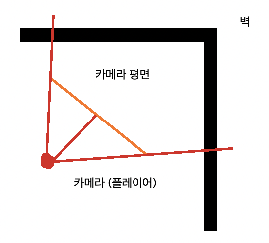
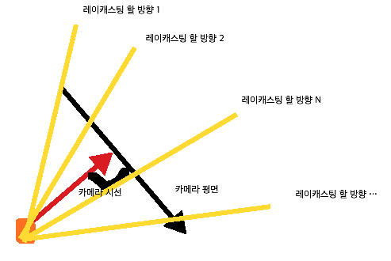
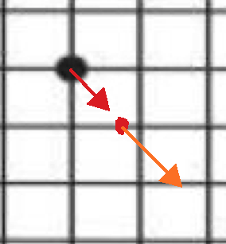
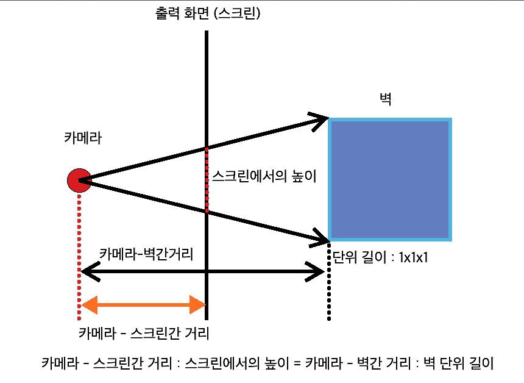
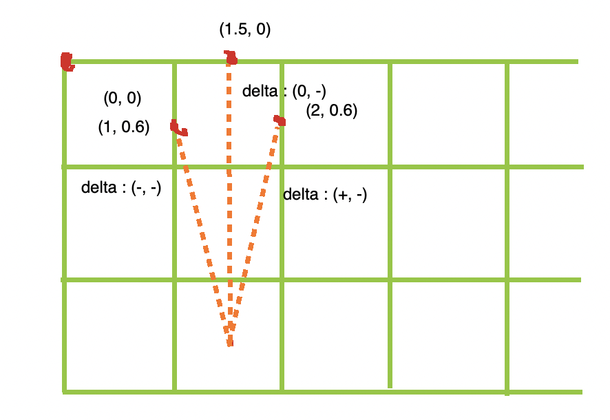
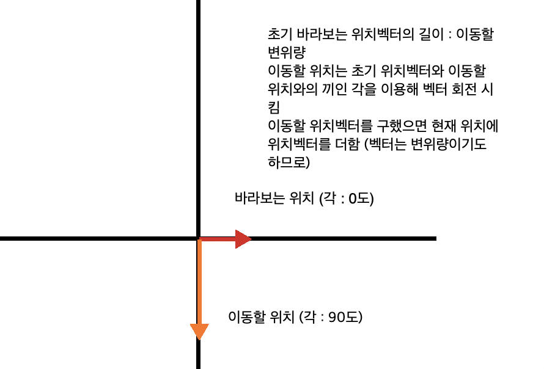
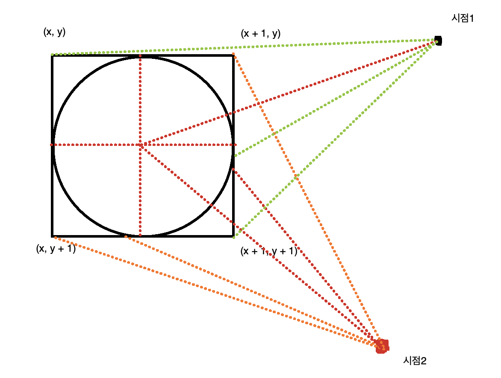
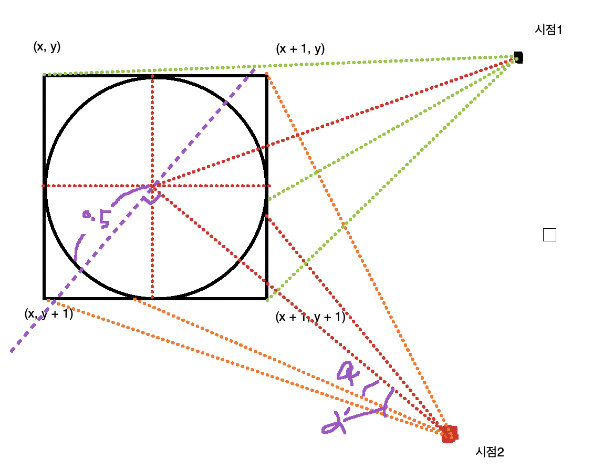

# OpenGL 기반으로 3d 게임 만들어보기 (cub3d)

cub3d, miniRT는 그래픽 작업을 하는 과제이며 공통적으로 제공하는 MiniLibX 라이브러리를 이용하여 키보드 입력 및 UI로 그래픽을 띄울 수 있게 해 준다.

해당 라이브러리를 사용하기 위해 별도 메뉴얼 파일을 제공한다.

## manual 열람법

```
# 예제 : man ./man/man3/(파일명).3
$> man ./man/man3/mix.3
$> man ./man/man3/mix_pixel_put.3
```

mlx.3가 MiniLibX 라이브러리의 전체 메뉴얼이다. 메뉴얼을 보면 MiniLibX는 리눅스/유닉스/맥에서 간단하게 그래픽 창을 띄워주고 기본적인 이벤트 (키보드 등 입력을 말하는 듯)를 사용할 수 있도록 해주는 라이브러리라고 한다.

MiniLibX API를 사용하려면 사용하려면 프로젝트에 mlx.h를 추가해야 한다.

mlx_init 함수를 이용해서 그래픽을 사용할 준비를 한다. 이후로 크게 4가지 함수를 이용해서 그래픽을 만들거나 마우스, 키보드 입력을 받는다.

- mlx_new_window : 윈도우 제어
- mlx_pixel_put : 윈도우 내부에 뭔가를 그림
- mlx_new_image : 윈도우 내부에 이미지를 그림
- mlx_loop : 키보드, 마우스 입력을 다룸

## 링킹 방법

링킹은 컴파일 작업을 할 때 다른 기계어로 번역된 파일을 합치는 것을 말한다.

예를 들어 main.c 와 prog.c 파일이 하나의 프로젝트라 하면 위 파일은 기계어로 바뀌고 (컴파일) 바뀐 파일을 하나의 실행파일로 바꾸는 것을 링킹이라 한다.

MiniLibX은 별도의 라이브러리 이므로 현재 사용하고자 하는 프로젝트에 추가시켜야 하는데 이 작업을 링킹이라고 한다.

컴파일을 할 때 다음 옵션을 넣는다.

```makefile
# 맥OS에서
-lmlx -framework OpenGL -framework AppKit -lz -L(라이브러리 경로)
# 유닉스나 리눅스에서
-lmlx -lXext -lX11 -L(라이브러리 경로)
```

## 환경 구성 해보기 및 창 띄워보기

Makefile 작성을 해본다.

```makefile
MMSPATH = ./libs/minilibx_mms_20200219
CLFLAGS = -lmlx -framework OpenGL -framework AppKit -lz

$(NAME): $(OBJS)
	make clean -C ${MMSPATH}
	make all -C ${MMSPATH}
	$(COMPILER) $(CFLAGS) $(OBJS) -I$(HEADERPATH) -L$(MMSPATH) $(CLFLAGS) -o $(NAME)
```

make의 -C 옵션으로 MiniLibX 라이브러리를 별도로 컴파일 한 후에 현재 프로젝트에 생성된 라이브러리를 링크해야 한다.

하지만 해당 작업 중 오류가 발생했다.

```shell
$> ./cub3d 
dyld: Library not loaded: libmlx.dylib
  Referenced from: /Users/joohongpark/Documents/code/42/42cursus/cub3d/./cub3d
  Reason: image not found
zsh: abort      ./cub3d
```

기존에 동적 라이브러리를 생성하는 과제는 확장자가 *.a 였다. 또 기존에 cub3d 과제에서 제공해 준 라이브러리도 *.a로 라이브러리가 생성되는 것으로 알고 있었다. 하지만 과제 수행을 위해 빌드해 보니 라이브러리 확장자가 *.dylib이었다. 슬랙에서 관련 문제를 검색해 보니 실행 바이너리에 해당 파일을 두거나 install_name_tool 이라는 명령어를 이용해 링크를 시켜야 한다고 한다.

나는 install_name_tool을 사용해서 해당 링크파일을 적용하려 했지만 원인 모를 오류가 발생해 (현재 install_name_tool와 동적 라이브러리 링크에 대해 완벽한 이해가 없기도 하고) 실행 바이너리에 해당 라이브러리를 복사하는 것으로 임시로 해결하기로 하였다.

실행한 테스트 코드는 다음과 같다.

```c
#include "cub3d.h"

int				main(void)
{
	void		*test;
	void		*test1;

	test = mlx_init();
	test1 = mlx_new_window(test, 300, 300, "hello");
	mlx_loop(test);
	return (0);
}
```

man 페이지를 참조해 mlx_init 함수와 mlx_new_window 함수를 사용했다. mlx_loop 함수를 이용해 창이 닫히지 않게 한다.

이제 이 코드를 바탕으로 창에 3d 그림을 출력해야 할 것이다...

## 키 입력 받기

man 페이지로 mlx_loop를 보면 hook 함수로 키 입력을 받는 함수들이 설명되어 있다.

```c

int				ft_key_press(int code, char *str)
{
	printf("code : %02x at %s\n", code, str);
	return (0);
}

int				ft_mouse_press(int code, int x, int y, char *str)
{
	printf("code : %02x(%d, %d) at %s\n", code, x, y, str);
	return (0);
}

int				ft_test(char *str)
{
	printf("code : X at %s\n",  str);
	return (0);
}

int				main(void)
{
	void		*test;
	void		*test1;

	test = mlx_init();
	test1 = mlx_new_window(test, 300, 300, "hello");
	mlx_key_hook(test1, &ft_key_press, "key");
	mlx_mouse_hook(test1, &ft_mouse_press, "mouse");
	mlx_expose_hook(test1, &ft_test, "expose");
	mlx_loop_hook(test1, &ft_test, "loop");
	mlx_loop(test);
	return (0);
}
```

hoop 함수는 해당 이벤트가 발생하면 특정 함수에 인수를 입력시켜 실행하도록 한다.

man 페이지에 설명되지 않은 함수 중 mlx_hook 이라는 함수가 있다고 한다. 하지만 현재까지 필요성을 못 느껴 추후에 필요성을 느낄 때 다시 사용할 계획이다. 해당 함수를 이용하면 창 닫기도 구현할 수 있다는 듯 하다.

## 윈도우에 무언가를 출력하기

띄운 창에 무엇인가를 출력해본다.

```c
#include "cub3d.h"

int				main(void)
{
	void		*test;
	void		*test1;
	void		*img;
	void		*img_xpm;

	int			*img_data;
	int			bits_per_pixel;
	int			size_line;
	int			endian;

	int			xy[2];

	test = mlx_init();
	test1 = mlx_new_window(test, 600, 600, "hello");

	/* 1. 픽셀을 직접 지정해서 출력 */
	// 이미지의 가로 세로 크기만큼 메모리를 할당한다.
	img = mlx_new_image(test, 256, 256);
	// 생성된 이미지의 픽셀 정보를 가져온다.
		// bits_per_pixel 에는 픽셀 하나당 차지하는 비트수가 들어가며 (32bit) 
		// size_line 에는 이미지의 한 줄을 저장하는 데 사용되는 바이트 수가 들어간다.
		// endian에는 해당 픽셀 컬러가 저장될 때 리틀 인디안인지 빅 인디안인지 여부를 나타낸다.
		// mlx_get_data_addr 함수는 char 형 포인터를 리턴하지만 int 형 포인터로 캐스팅해야 한다.
	img_data = (int *)mlx_get_data_addr(img, &bits_per_pixel, &size_line, &endian);
	for (int i = 0; i < 256 * 256; i++)
		img_data[i] = i;
	printf("%d, %d, %d\n", bits_per_pixel, size_line, endian);

	/* 2. xpm 파일을 불러와서 출력 */
	img_xpm = mlx_xpm_file_to_image(test, "./test.xpm", &xy[0], &xy[1]);
	
	mlx_put_image_to_window(test, test1, img, 0, 0);
	mlx_put_image_to_window(test, test1, img_xpm, 256, 256);
	mlx_loop(test);
	return (0);
}
```

xpm 파일은 MiniLibX에서 사용하는 그림 파일 포맷이다. 자세한 건 아직 잘 모르는 상태에서 우선 그림파일 출력부터 해본다.

mlx_new_image 혹은 mlx_xpm_file_to_image 함수를 이용해서 이미지를 생성한다.

생성한 후 mlx_put_image_to_window 함수를 이용해 지정한 위치에 출력한다.

작성하면서도 아직 뭐가 뭔지 잘 몰라 다른 예제들을 코딩하면서 감을 익힐 것이다.

## mlx_get_data_addr

mlx_get_data_addr에 대해서 더 공부해 보았다.

우선 MiniLibX에서 그림을 직접 그릴 때 4가지 요소를 이용해서 그림을 그린다.

요소는 각각 투명도/빨강/녹색/파랑색 4가지 요소를 각각 1바이트 길이로 담는다.

이는 bits_per_pixel에 명시되어 있으며 해당 값은 32(bit)로 이를 4로 나누면 1바이트가 된다.

따라서 하나의 픽셀 당 데이터를 한꺼번에 다루기 위해 4바이트 32bit인 데이터형인 int형으로 캐스팅해서 사용하는 것이다.

캐스팅하지 않으면 char형 포인터로 접근하게 되는데 이럴 때에는 32bit를

[B] [G] [R] [투명도] 순으로 저장하게 된다.

하지만 이를 4바이트 int형으로 캐스팅하면 대부분의 컴퓨터 cpu 플랫폼은 little endian 순으로 바이트를 저장하므로

4바이트 int형은 [투명도] [R] [G] [B] 순으로 저장하게 된다.

참고로 endian 여부는 endian 변수에 저장된다.

size_line에는 출력되는 그림의 한 줄의 전체 사이즈를 표시하는 것이다. 하지만 대개 임의로 지정한 width보다 더 크게 size_line 값이 잡힌다. 해당 이유는 아직 잘 못하지만 이로 인해서 다음 줄로 내릴 때 size_line만큼의 offset을 곱해주어야 한다. (int로 캐스팅할 때에는 size_line / 4로 나눈 값을 곱한다.)

따라서 올바르게 사용하려면 다음과 같다.

```c
	img_data = (int *)mlx_get_data_addr(img, &bits_per_pixel, &size_line, &endian);
	for (int i = 0; i < 256; i++)
		for (int j = 0; j < (size_line / 4); j++)
			img_data[i * (size_line / 4) + j] = 0x00FFFFFF;
```

## 벡터 구현

아직 게임을 어떤 식으로 만들어야 할지 감이 전혀 오지 않는다. 하지만 맵을 출력하는 데 벡터 지식이 쓰인다 하여 벡터를 먼저 구현해 보기로 했다.

### 벡터 자료형 구현

우선 x, y 좌표계만 간단하게 구현해 본다.

```c
typedef	struct		s_vector
{
	double			x;
	double			y;
	double			z;
}					t_vector;
```

벡터 연산시 소수점 연산을 해야 하므로 double 자료형을 사용하기로 했다.

### 벡터 초기화 함수

벡터를 초기화 하는 함수는 두 가지 형태로 만들 수 있다. 함수 내에서 새로운 벡터를 만들어 리턴 시 백터가 복사되게 하거나 초기화 함수 인수에 벡터 주소를 집어 넣어 직접 값에 접근하는 방식이 있다.

속도는 포인터를 사용하는 것이 유리하지만 일단 가독성을 위해 포인터를 사용하지 않기로 했다. 추후에 속도 이슈가 발생하면 포인터로 수정할 것이다.

```c
t_vector		ft_vinit(double x, double y, double z)
{
	t_vector	rtn;

	rtn.x = x;
	rtn.y = y;
	rtn.z = z;
	return (rtn);
}
```

### 벡터 연산 함수

벡터끼리 더하는 함수, 빼는 함수, 스칼라곱을 하는 함수 등을 만들어 보았다. (생략)

### 삼각함수

cub3d 과제에서는 여러 수학 연산이 필요하다. 삼각함수 연산도 필요하다. 그래서 수학 연산 관련 라이브러리를 사용할 수 있다.

쉘에 man 3 math 를 입력하면 제공하는 함수와 설명을 볼 수 있다.

math 라이브러리에서 제공하는 삼각함수는 입력값이 도(degree) 가 아니라 라디안이 들어간다. 따라서 30도는 pi/6이다.

그러면 pi 값을 알고 있어야 하는데 저 라이브러리에서 M_PI 라는 상수로 파이 값을 제공해 준다.

예를 들면 이렇게 사용한다.

```c
printf("sin(pi/6) = %f\n", sin(M_PI / 6));
```

## Cub3d 요구사항

- 보너스 받기 위해선 make bonus 추가
- libft 사용시 libft 내의 makefile로 컴파일 할 수 있게
- 벽 동서남북 서로 다른 질감 표현
- 벽 말고도 아이템 표시할 수 있게
- 바닥과 천장 서로 다르게
- wasd 키로 시점 이동
- esc 키로 프로그램 종료
- 닫기 버튼 누르면 프로그램이 종료되어야 함.
- 지도에 표시된 화면 크기가 디스플레이 해상도보다 크면 디스플레이 해상도에 따라 윈도우 크기 자동 설정?
- .cub 파일 파싱 (추후에 다시 작성)

## 지도 그리기

2차 배열을 통해 임의로 지도를 만들어 본다.

```c
	char		map[10][10] = {
		{1, 1, 1, 1, 1, 1, 1, 1, 1, 1},
		{1, 0, 0, 0, 0, 0, 0, 0, 0, 1},
		{1, 1, 1, 1, 1, 1, 1, 1, 0, 1},
		{1, 0, 0, 0, 0, 0, 0, 0, 0, 1},
		{1, 0, 0, 0, 0, 0, 0, 0, 0, 1},
		{1, 0, 0, 0, 0, 0, 0, 0, 0, 1},
		{1, 0, 0, 0, 0, 0, 0, 0, 0, 1},
		{1, 0, 0, 0, 0, 0, 0, 0, 0, 1},
		{1, 0, 0, 0, 0, 0, 0, 0, 0, 1},
		{1, 1, 1, 1, 1, 1, 1, 1, 1, 1}
	};
```

윈도우에 무엇인가를 출력하기 위해서는 픽셀 배열에 접근해 조작해야 한다. 출력되는 화면 좌우가 w, 상하가 h라고 하면 위 배열을 어떻게 적용할 것인가?

내가 생각한 알고리즘은 다음과 같다.

x축에 대해서 먼저 생각해 본다. 위 맵의 길이는 10이고 인덱스는 0~9까지의 값을 가질 수 있다. 그러면 인덱스 : 맵 길이 = 벽 또는 공간 : w의 비례식이 성립한다.

위 맵의 인덱스가 가리키는 값에 따라 벽/공간이 결정되므로 인덱스 = (맵 길이 * 벽 또는 공간) / w 의 관계가 성립한다.

C에서 정수 자료형으로 나누어 떨어지지 않는 값을 나눌 시 소수점은 버리므로 배열 인덱스에 넣어도 정상적으로 동작한다.

그러면 다음과 같이 코딩할 수 있다.

```c
void			ft_draw_map_proto(t_canvas *area, t_map map)
{
	for (int i = 0; i < area->img.height; i++)
	{
		for (int j = 0; j < (area->img.size_line / 4); j++)
		{
			if (map.map[((map.y * i) / area->img.height)][((map.x * j) / area->img.width)] == 1)
				area->img.data[i * (area->img.size_line / 4) + j] = 0x000000FF;
			else
				area->img.data[i * (area->img.size_line / 4) + j] = 0x00000000;
		}
	}
}
```

키보드 키 값을 받아서 플레이어가 움직이는 것도 구현해본다. mlx에서 제공하는 콜백함수를 이용하면 된다.

이벤트 콜백함수 중 mlx_loop_hook가 존재한다. 해당 함수는 mlx가 화면을 다시 그릴 수 있는 상황에서 계속 호출시키는 함수이다.

구현할 때 해당 콜백함수를 통해 mlx_clear_window / mlx_put_image_to_window 함수를 통해 이미지를 지우고 다시 그려야 하지만 그렇게 하면 불필요한 이미지 그리기를 많이 하게 된다.

따라서 키보드 키를 눌러 다시 그릴 필요가 있을 때에만 위 함수를 콜하면 리소스 낭비를 줄일 수 있다.

```c
int				ft_draw(t_canvas *obj)
{
	if (obj->draw == 1)
	{
		mlx_clear_window(obj->window, obj->canvas);
		mlx_put_image_to_window(obj->window, obj->canvas, obj->img.img, obj->img.x, obj->img.y);
		mlx_put_image_to_window(obj->window, obj->canvas, obj->player.img, obj->player.x, obj->player.y);
		obj->draw = 0;
	}
	return (0);
}
```

obj.draw는 초기 init 할 때와 키보드 이벤트가 발생할 때에만 1로 set 하면 된다.

## 선 그어보기

이제는 선을 그어볼 것이다. 단순히 선을 긋는 것이 아니라 위치 a와 b 사이 간 선을 긋고 그 사이의 거리를 구하는 알고리즘을 공부해 볼 것이다.

"레이캐스팅" 이라는 것을 이용해 지도를 3d처럼 보이게 구현한다. 레이캐스팅이라는 기술을 사용하려면 선을 긋는 것이 기본이므로 선부터 그어보기로 했다.

선을 긋는 데는 DDA 알고리즘 혹은 브레젠함 알고리즘이 사용된다.

- DDA 알고리즘
  - DDA의 약자는 Digital Differential Analyzer이다.
  - DDA 알고리즘은 두 점 사이의 기울기를 구해서 차등 방정식에 대입해서 점을 찍는 것이다.
  - 부동 소수점 연산을 하기 때문에 별도의 최적화를 하지 않으면 느릴 수 있다.
- 브레젠함 알고리즘
  - DDA 알고리즘처럼 1차 방정식을 이용하지만 기울기에서 발생되는 소수점을 없애 정수로만 연산하게 한다.
  - 대신 1차 방정식을 변형하여 판별식을 만든다.
  - 가로 혹은 세로로 종료 점까지 1씩 가산해 가며 점을 찍는 것이다.
  - 그릴 점이 직선보다 위에 혹은 밑에 있는지 판별식을 이용해서 판별한다.

### 레이캐스팅 (광선 투사)

레이캐스팅은 플레이어가 보는 시각부터 벽까지의 거리를 측정해서 거리만큼 벽의 높이를 정하는 것이다. 원근법의 원리를 이용한 것이며 이는 실제 3차원이 아니라 2차원 지도를 3차원처럼 보이게 하는 것이다.

보통은 카메라 (플레이어가 보는 시각)와 카메라평면 (궂이 비유하자면 모니터 프레임 정도?)를 이용해서 광선 투사를 한다. DDA 알고리즘은 광선 하나 하나에 대해 투사를 하는 데 이용되며 카메라와 카메라평면은 레이캐스팅을 하는 방향을 구하기 위해 사용된다. 여기에 벡터가 사용된다.



대충 위와 같은 느낌이다. 시각을 좌우로 이동하면 카메라 평면이 이동하는 식이다.

저기 카메라와 카메라 평면 양 끝 사이의 끼인 각을 FOV(Field Of View) 라고 한다.

당연히 저 FOV라는 각은 카메라 평면의 길이와 카메라와 카메라 평면 사이의 길이로 정해지며 이는 볼 수 있는 시야에 영향을 미친다.

### 광선 방향 구하기

카메라 평면과 카메라 사이의 삼각형은 이등변 삼각형을 붙여논 꼴이 되어야 한다. (이 가정을 세우지 않으면 시각에 왜곡이 발생한다.)

또 카메라 평면과 카메라에서 카메라 평면을 보는 시선 두 가지 요소는 벡터로 표시한다. (그래야 개념적으로도 계산하기에도 수월하다.)



위에서 화살표로 표시한 부분이 벡터이고 카메라 시선벡터와 카메라 평면벡터로 레이캐스팅 할 방향을 구하는 식이다.

FOV는 두 벡터의 크기에 따라 정해지는데 보통 0~1 사이의 값을 사용한다. (보통 카메라 시선벡터 = 1, 카메라 평면벡터 = 0.66을 사용한다.)

레이캐스팅을 할 때에 위에 노란 광을 얼마나 조밀하게 쏘느냐에 따라 퀄리티가 달라질 것이다. 광선 방향은 다음과 같이 정한다.
$$
\vec{카메라시선} + s\vec{카메라평면} \ (-1 \le s \le 1)
$$
카메라평면에 스칼라곱을 -1부터 1까지 조정한 후 거기에 카메라 시선을 더하면 레이캐스팅 할 방향이 정해진다.

저 노란색 광선의 개수는 출력할 화면의 x축 픽셀 개수 만큼 잘라서 반복한다.

만약에 사용자가 키보드로 시선을 옮긴다면 카메라 시선벡터와 카메라 평면벡터 둘 다에 삼각함수를 이용해 벡터를 회전시켜야 한다.

이제 광성 방향과 광선 시작점을 알 수 있게 되었으니 이제 선을 상세히 어떻게 그을것인지와 공간과 벽을 어떻게 판단할지 고민해본다.

### 광선이 부딪히는 벽 찾기

광선의 출발점과 벡터를 알고 있으니 이를 기반으로 광선이 벽에 부딪히는 위치를 찾아내야 한다.

지도는 가로세로 길이가 1인 블록으로 되어있고 광선의 출발점(카메라/플레이어 위치)과 광선이 벽에 부딫히는 점은 소수점으로 되어 있다.

예를 들면 지도의 (0,0), (0,1), (1,0) 위치에 벽이 있고 (1,1) 위치에 공간이 있다면 플레이어는 (1, 1) 부터 (2, 2) 사이 공간에 존재할 수 있는데

(1.2, 1.2) 위치에 있을수도 있는 것을 의미하는 것이다.

관련 자료를 찾아보면 수학 공식을 사용해서 (그마저도 사전에 알아야 할 정의 등을 생략해놓아서) 처음 접하는 사람들이 보면 매우 복잡하게 설명이 되어 있는데 쉽게 설명하면 광선 (기울기 혹은 벡터로 표현되는)이 지나가는 x절편/y절편을 추척해 나가는 것이다. 단 여기서의 절편은 x나 y가 자연수가 되는 절편을 의미한다.

절편을 찾는 이유는 지도와 벽 자체는 자연수로 이루어져 있고 사용자는 자연수 사이 실수 범위에 존재하며 광선을 쏠 때 벽은 절편에 존재하기 때문이다.

각 절편을 찾아가면서 해당 자리가 벽인지 공간인지를 판단해 광선을 쏘는 것이고 벽을 만나면 절편 찾기를 중단하는 식이다.

### X축과 Y축

x절편/y절편에 맞닿는 점을 따로따로 찾을 수 밖에 없다. (나는 이 사실을 모르고 카메라 위치에서부터 떨어진 거리 순서대로 x절편/y절편을 찾아가는 알고리즘을 고민하느냐 늦어졌다.) 다른 좋은 알고리즘이 있다면 적용하는것이 좋겠지만 내가 본 예제들은 이런 식으로 구현되어 있다. 또 먼저 구현을 해보고 비효율적이거나 더 좋은 방법이 있다면 수정하는 것이 좋을 것 같다.

일단 플레이어(카메라)의 좌표에서 광선의 방향대로 나아갈 때 x절편/y절편과 만나는 점을 각각 구한다.

이후 해당 위치에 공간이 있을 때까지 루프를 돌면서 현재 x절편/y절편 기준으로 y증분/x증분을 더해간다.

이렇게 해서 x절편을 통해 구한 좌표와 y절편을 통해 구한 좌표 중 카메라의 좌표와 가까운 좌표가 벽과 충돌하는 좌표이다.



위 그림을 보면 검은색 점이 플레이어(카메라)의 위치이고 빨간색 화살표는 광선 벡터이다. 해당 방향대로 광선을 쏘면 y축과 가장 먼저 만나는 점은 빨간색으로 칠한 부분이 된다. 이 부분을 임의로 xstart라고 명명한다. 이후로는 y가 1씩 증가한 만큼에 대해 x의 증분을 더해주면 되는데 이를 나타낸 것이 주황색 화살표이다.

y절편에 닿는 예제 코드는 다음과 같다.

```c
t_vector			ft_xstart(t_vector player, t_vector ray)
{
	t_vector		rtn;

	// 광선의 방향에 따라 y 절편에 닿는 방향?이 달라짐. (광선의 x방향 증분에 따라 변하므로)
	rtn.x = (int) player.x + (ray.x > 0 ? 1 : 0);
	// 직선 방정식을 이용해 y 점을 구함.
	rtn.y = (rtn.x - player.x) * (ray.y/ray.x) + player.y;
	return (rtn);
}
```

x절편도 위와 같은 방식대로 하면 된다.

이후로 증분만큼 더하는 알고리즘에 대한 예제 코드는 다음과 같다.

```c
t_vector			ft_xwall(t_vector xstart, t_vector ray)
{
	t_vector		rtn;
	// x가 1 증가할 때에 대한 y의 증분
	double			dy;
	int				_tmp;

	dy = ray.y/ray.x;

	rtn = xstart;
	_tmp = 0;
	while (_tmp++ < 10)
	{
		if (ray.x > 0)
		{
			rtn.x += 1;
			rtn.y += dy;
		}
		else
		{
			rtn.x -= 1;
			rtn.y -= dy;
		}
		printf("[debug](%f, %f)\n", rtn.x, rtn.y);
	}

	return (rtn);
}
```

while 문에 일정 횟수만큼 반복하는 것이 아닌 현재 위치가 빈 공간인지 아닌지 혹은 해당 위치가 주어진 지도에서 벗어나지 않는지 등을 체크하는 조건을 삽입하여야 한다.

### 벽 찾기

x, y좌표는 부동소수점으로 주어지며 좌표자체는 정수로 존재한다. 아런 경우는 소수점을 잘라버리고 해당 좌표에 벽이 있는지 판단하면 된다. 예를 들면 x,y 좌표가 소수점 사이에 있으면 단순히 소수점을 잘라버리면 되지만 문제는 경계점에서 발생한다.

예를 들어 x,y 좌표가 (2.3, 3.4) 이고 (2,3) 좌표가 벽이라면 해당 좌표는 무조건 벽에 있을 수밖에 없다. 하지만 (2.0, 3.4)와 같이 좌표가 주어지면 이 위치에는 벽이 있다고 해야 할까? 없다고 해야 할까?

이런 경우에는 (1, 3) 좌표에도 벽이 있는지 판단해야 한다. 따라서 소수점이 없는 좌표가 주어진 경우는 경계점이 주어진 것이므로 경계에 벽이 있는지 반드시 확인하여야 한다.

```c
int					ft_checkspace(t_vector v, t_map map)
{
	int				x;
	int				y;

	if (isnan(v.x) || isnan(v.y) || isinf(v.x) || isinf(v.y)
		|| v.x < 0 || v.y < 0 || map.x <= v.x || map.y <= v.y)
		return (0);
	x = (int)v.x;
	y = (int)v.y;
	if ((x * 1.0 == v.x) && map.map[y][x - 1] != 0)
		return (0);
	if ((y * 1.0 == v.y) && map.map[y - 1][x] != 0)
		return (0);
	if (map.map[y][x] != 0)
		return (0);
	return (1);
}
```

### x절편(x = 자연수인 축과 만나는 점)과 y절편(y = 자연수인 축과 만나는 점)에 대한 좌표

위 루틴을 돌려서 광선이 벽과 만나는 점을 두 개 얻을 수 있다. 구해보면 알겠지만 한 점은 광선이 벽에 닿는 점이 있고 다른 한 점은 광선을 뚫고 지나가는 점이다. 두 점 중 카메라 위치와 가까운 점이 올바르게 레이캐스팅을 한 위치이다.

### 대충 레이캐스팅 해보기

위에서 카메라 위치와 카메라 벡터를 이용해서 레이캐스팅 함수를 만든다. 출력될 스크린의 가로 픽셀 개수만큼 레이캐스팅을 하면 현재 시점에서 벽과 거리가 얼마나 떨어져 있는지 알 수 있다. 레이캐스팅을 한 결과는 스크린의 한 픽셀에 대응해 나오므로 해당 값을 이용해 세로 픽셀을 만든다.

현재는 레이캐스팅이 정상적으로 동작하는지 테스트를 하는 것이 목적이므로 시점(높이)을 중간으로 잡고 대충 레이캐스팅을 해본다.

```
// 카메라 벡터 구하는 구간 ((i - 500) / 500.0이 plane 카메라 평면 벡터를 -1부터 1까지 크기를 조정한다.)
ray = ft_vadd(tcam, ft_vscala(tplane, (i - 500) / 500.0));

// 벽 그리는 함수
void			ft_draw_wall_proto(t_img *img, int x, double y)
{
	int			h;

	h = (int)(y * (img->height / 2));
	for (int iy = 0; iy < img->height; iy++)
	{
		if (iy > ((img->height / 2) - h) && iy < ((img->height / 2) + h))
			img->data[iy * (img->size_line / 4) + x] = 0x0000FFFF;
		else
			img->data[iy * (img->size_line / 4) + x] = 0x00000000;
	}
}
```

아직 어안렌즈 보정도 하지 않았으며 평면 스크린 시점도, 바라보는 높이도 별도로 조정하지 않았으므로 다소 이상하게 출력되긴 하지만 그래도 벽을 나타낸 무엇인가가 출력되긴 한다. 이제 여기에 보다 정밀하게 스크린 시점을 적용하고, 바라보는 높이도 적용해보고, 어안렌즈 보정도 하고, 시점에 따른 벽의 명암도 적용해 볼 것이다.

### 어안렌즈 보정

어안렌즈 보정에 대해 흥미가 더 있어서 먼저 어안렌즈부터 보정해보기로 했다.

카메라에 상이 맻힐 때 한 점에 상이 맻히는게 아니라 스크린에 상이 맺히는 것이다. 근데 위에서 계산한 기준은 카메라 점에서 나가는 광선을 기준으로 했으므로 왜곡이 발생한다. 엄밀하게 하려면 카메라 평면에서 나가는 광선을 기준으로 해야 한다.

하지만 애초에 카메라 점으로부터 나가는 광선을 기준으로 했으므로 왜곡을 보정하는 방법을 사용한다.


카메라가 카메라 평면을 향하는 벡터와 광선 벡터의 끼인 각을 베타로 두고 광선을 발사해 얻은 거리에 cos(베타) 값을 곱하면 된다. 

내가 구현한 방식은 카메라 평면을 향하는 벡터에 단위벡터를 구해 광선벡터를 구하는 것이므로 두 벡터의 크기를 구해서 cos(베타) 값을 구할 수 있다.

### 스크린 시점



카메라-스크린간 거리 : 1로 놓고 벽의 단위 길이가 1이므로 스크린에서의 높이는 카메라와 벽간 거리의 역수가 된다.

### 벽 동서남북 구분하기

어디를 북쪽으로 삼을건지도 중요하지만 4가지 면에 대해 각각 방향을 정할 수 있는 기준을 먼저 정해야 한다.

점 p에서 광선 r을 따라 벽의 점 q에 닿는 경우는 x, y 좌표계에서 점의 이동량과 닿은 점을 통해 동서남북을 알아낼 수 있다.



카메라 위치 p에서 위 그림 왼쪽 벽에 닿는 위치를 생각해 보자. 변위량은 x, y 모두 마이너스이다. 저 상황에서는 반드시 북쪽 혹은 서쪽 벽에만 닿을 수 있다. 이 상황에서 닿는 점이 북쪽 혹은 서쪽을 결정하는데 이는 x 혹은 y가 정수로 떨어지는지로 판단할 수 있다. 이와 같이 모든 상황에 대해서 케이스를 나누면 각 면이 구분이 되는 벽을 만들 수 있다.

## 벽에 스트라이프 그려보기

### 사진 스케일링

사진 크기 변경을 하는 알고리즘은 여러가지가 있지만 일단은 단순하게 x와 y의 좌표값이 크기에 따라 변하는 방식으로 해보기로 했다.

```c
			cx = j * w.tmp[0].width / w.tmp[1].width;
			cy = i * w.tmp[0].height / w.tmp[1].height;
```

### x의 위치?

스케일링 되는 y의 값은 레이캐스팅 되는 거리 값 그 자체이므로 y값은 구하기 너무 쉽다. 하지만 레이캐스팅 되는 거리 값으로는 그 지점 자체가 벽에서 x위치가 얼마나 되는지는 알 수 없다. 따라서 레이캐스팅 되는 점의 좌표값을 알아내야 한다.

레이캐스팅 되는 좌표값의 x 혹은 y값은 반드시 정수 값을 가지게 된다. (벽에 맞기 때문에) 따라서 정수 값을 가지고 있지 않은 좌표의 소수점이 벽으로부터 얼만큼 떨어졌는지의 비욜 (ratio)가 된다.

따라서 벽을 간단하게 구분하는 코드를 작성해보면 다음과 같다.

```
int					ft_makewall(t_vector w, unsigned char r, unsigned char g, unsigned char b)
{
	double			ratio;

	if (((int)w.x) * 1.0 != w.x)
		ratio = w.x - ((int)w.x) * 1.0;
	else
		ratio = w.y - ((int)w.y) * 1.0;
	r = (r < ratio * 255) ? 0 : r - ratio * 255;
	g = (g < ratio * 255) ? 0 : g - ratio * 255;
	b = (b < ratio * 255) ? 0 : b - ratio * 255;

	return (ft_rgba(r, g, b, 0x00));
}
```

핵심 부분은 x 좌표 혹은 y 좌표가 정수인지 판단한 후 정수가 아닌 좌표의 소수점을 구하는 것이다.

## 상하좌우 이동 보완하기

지금 상화좌우 구현은 간편함을 위해 플레이어가 바라보는 시각으로 이동하지 않고 상화좌우 이동하는 방향이 아예 고정되어 있다.

따라서 현재 플레이어가 바라보는 방향을 기준으로 상화좌우 이동할 수 있도록 구현해야 한다.

x, y축에 대해 기준점을 잡은 후 어느 방향으로 얼만큼 나갈 지 정한 다음 플레이어가 바라보는 방향으로 벡터 회전을 시키면 된다.



### 벽 가로질러서 가지 못하게 하기

벽을 가로질러서 가지 못하게 하려면 현재 위치에서 정수 부분이 벽인지 아닌지 판별하면 된다.

판단해야 하는 시점은 이동량만큼 이동했을 때 해당 위치가 벽이면 x, y만큼 이동하기 이전 거리만큼 이동하여야 한다.

만약에 x, y 둘 중 하나만 이동할 때 벽을 가로지르지 않으면 둘 중 하나는 그대로 두고 다른 하나는 이동하도록 한다.

## 스프라이트 출력

스프라이트는 레이캐스팅(벽 ~ 카메라) 한 경로에 스프라이트가 있으면 해당 좌표를 LIFO 구조의 스택에 넣은 후 벽을 렌더링 할 때 스프라이트를 그리는 식으로 동작한다.

### LIFO

LIFO 스택은 기존에 만들어놓았던 libft 라이브러리를 기반으로 구현한다. libft bonus 라이브러리에는 링크드 리스트가 구현되어 있는데 링크드 리스트 자료구조를 이용하면 LIFO 스택을 간단하게 구현할 수 있다.

### 스프라이트 레이캐스팅

벽 레이캐스팅을 하는 도중에 스프라이트가 존재시 스택에 삽입하는 것이 좋을것이다. 하지만 지금은 각 함수당 명확한 역할 구분을 위해 레이캐스팅 후 스프라이트를 찾기 위한 레이캐스팅을 별도로 한다.

### 스프라이트의 위치와 형태

스프라이트의 위치는 레이캐스팅이 되는 소수점이 붙은 좌표가 아닌 그 스프라이트가 존재하는 2차원 배열의 위치를 반환하여야 한다. 만약에 레이캐스팅이 되는 소수점이 붙은 위치를 이용해서 스프라이트의 크기를 판단한다면 벽 모양 스프라이트가 될 것이다.

## 스프라이트는 어떻게 보여야 하는가?

만약에 벽과 동일하게 레이캐스팅 하여 스프라이트가 존재하는 공간에 스프라이트를 무작정 뿌리면 벽은 각져있기 때문에 보는 시야에 따라 스프라이트가 늘어나 보이고 그럴 것이다.

울펜슈타인 3D 같은 게임 상에서 스프라이트는 스프라이트 주위를 360도 돌면서 보아도 스프라이트의 크기는 거리에만 비례하며 x축으로의 길이가 동일함을 알 수 있다.



위 그림에서 배열의 한 칸을 차지하는 스프라이트에 대해서 레이캐스팅을 하는 두 가지 시점을 나타낸 것이다. 만약 시점 2에서 스프라이트를 바라보면 어떻게 보여야 할까? 스프라이트가 저 시점에서 차지하는 너비는 크기가 항상 1이어야 정상적으로 보일 것이다. 따라서 시점 2에서 (x, y + 1)으로 레이캐스팅 하는 점에 대해서 상을 띄워서는 안된다.

이것을 어떻게 판단하는가 하면 시점에서 배열의 중심 (x + 0.5, y + 0.5)을 향하는 벡터와 레이캐스팅을 하는 벡터의 끼인 각을 이용해서 판단한다.

위 그림을 잘 보면 상이 맻혀야 하는 부분은 내부의 동그라미 시점에만 상이 맻혀야 함을 직관적으로 알 수 있다.



시점 2에서 레이캐스팅을 할 때 방향을 나타내는 벡터와 시점 2에서 스프라이트의 중심을 향하는 벡터를 이용해 끼인각 (알파)를 구한다. 이후 시점 2에서 스프라이트의 중심까지의 길이 분의 1이 탄젠트 알파값이다. 따라서
$$
-0.5 \le tan(\alpha) \times(시점2부터 (x + 0.5, y + 0.5)까지의 거리) \le 0.5
$$
을 만족하는 부분에만 스프라이트를 출력해야 하며 이 값을 이용해 스프라이트에서 어느 부분의 x값을 가져와야 하는지도 알 수 있다.

### 벽/스프라이트를 출력하는 반복문을 하나의 함수로 합침

벽이나 스프라이트를 출력하는 기능은 명확하게 정의되어 있다.

- 현재 출력할 화면의 특정 x 좌표에 y를 화면의 y축 길이만큼 그린다.
- 그리는 대상의 원본은 특정 그림으로부터 가져오지만 어느 부분을 가져오는지는 다른 알고리즘에서 정한다.
- 어느 부분을 가져올지는 가져올 그림의 width/height가 각각 다를테니 0~1 사이의 실수 (비율)로 표기하는게 좋을거 같아서 비율로 표기하기로 했다.
- 예를 들어 0.5, 0.5라면 그 그림의 정중앙의 픽셀을 가져오는 식이다.
- 만약 저 비율이 1을 초과한다면 그 그림을 확대해야 한다.

위 기능을 위해서 필요한 변수는 (출력할 화면/원본 그림/출력할 x좌표/현재 시점에서 가리키는 x/y 좌표) 4가지 종류면 된다.

위 기능은 내가 임의로 기능 구현하며 코딩한 것으로 사람마다 다를 수 있다. 하지만 중요한건 기능을 모듈화하여 유지보수나 가독성을 원활하게 함에 있다.

## 인수 입력

cub3d에서 인수로 받아들일 수 있는 인수는 두 가지가 있다.

- "--save"
- ".cub 파일 경로"

먼저 두 가지 인수를 받아들일 수 있도록 관련 함수를 만든다.

### get_next_line 활용

파일을 읽어와서 파싱하는 동작이 있고 파일 내용의 구분은 한 줄 한 줄 읽어와 파싱하는게 편하다 판단해 기존 프로젝트에서 사용한 gnl 프로젝트를 가져와 사용하기로 했다.

해당 프로젝트는 static 변수를 사용하는데 static 변수를 사용하지 말라는 조항은 없지만 권장하지 않는다는 말을 들은 것 같아 static 변수 사용을 하지 않게 수정하여 해당 프로젝트에 삽입하였다.

## 사진파일 열기

.cub 파일 내에 경로로 명시된 사진파일을 열 때 해당 파일이 존재하지 않을 수도 있다. 해당 파일이 존재하는지만 확인하기 위해 open() 함수로 파일에 접근만 해 본 후 파일이 정상적으로 존재하면 파일을 mlx 라이브러리를 이용하여 읽어 들인다.

## 유효한 지도 판별

유효한 지도를 판별해야 한다. 유효한 지도를 판별하려면 어떤 것이 유효한 지도인지부터 기준을 먼저 세워야 한다.

유효한 지도란

- 플레이어가 존재해야 함
- 플레이어가 존재할 수 있는 공간이 최소한 1 이상이어야 함
- 플레이어가 존재하는 공간이 닫힌 공간이어야 함

이 조건을 충족해야 한다.

이런 상황에서는 보통 백트래킹 알고리즘을 사용해서 지도의 유효성을 판별한다.

### 백트래킹

백트래킹(backtracking)이란 한글로 풀이하면 "퇴각 검색"인데 트리나 그래프 자료구조에서 특정 조건을 만족할 때까지 뻩어나가며 탐색하며 조건을 만족할 시 퇴각하여 다른 트리나 그래프를 탐색하는 구조이다.

백트래킹은 트리나 그래프에서 사용되며 2차원 배열도 일종의 그래프이고 지도는 2차원 배열로 표기되므로 백트래킹을 사용하기 적합하다.

### 백트래킹의 종류

백트래킹은 크게 DFS, BFS가 있다.

#### DFS

어느 특정 위치에서 한 방향으로만 끝이 나올 때까지 직진하는 방식이다. 예를 들어 지도 판별을 예로 든다면 플레이어 위치에서 특정 방향으로 벽이 나올때까지 직진한 후 벽이 나오면 퇴각하여 다른 방향으로 향하는 것이다.

#### BFS

특정 위치에서 분기되는 모든 지점을 우선적으로 탐색한다. 하지만 지점마다 스택을 할당해야 하므로 스택 오버플로우가 발생하기 쉽다.

### 가지치기

끝이 없는 길로 가버리는 DFS나 무한히 많은 지점을 고려하는 BFS를 방지하기 위해 가지치기를 한다. 무의미한 탐색 혹은 이미 탐색한 지점을 잘라버려 탐색 횟수를 줄인다.