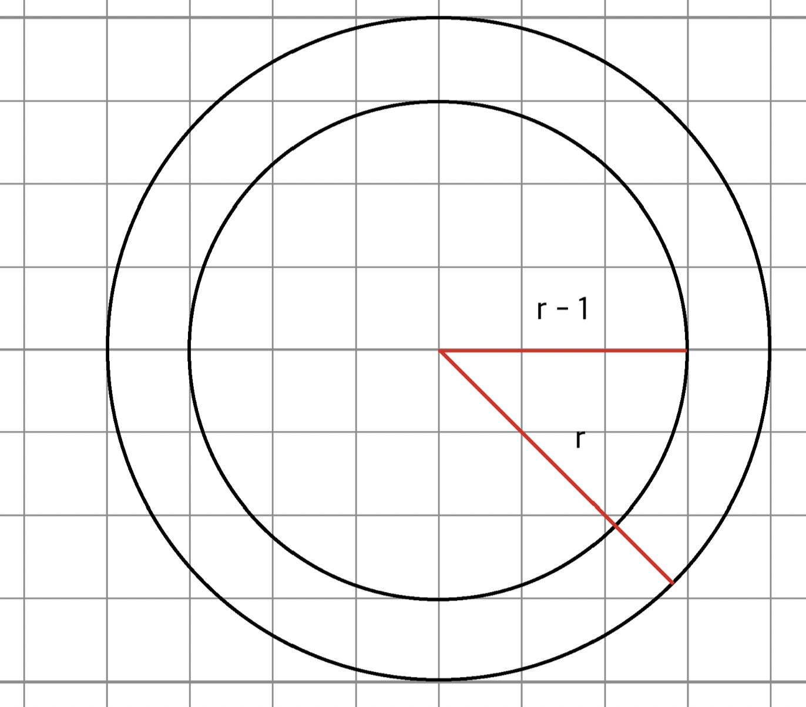

# 쉘에다 그림그리기 (mini_paint / micro_paint)

## mini_paint

## 사용 가능한 함수

> fopen, fread, fscanf, fclose, write, malloc, calloc, realloc, free, memset, powf, sqrtf

## 목적

인수로 파일을 받아 파싱하여 파일에 적힌 명령대로 쉘에 출력한다.

## 동작

프로그램은 정상 동작후 종료되면 0을 리턴하고 비정상 동작후 종료되면 1을 리턴한다. (이는 프로그램 실행 후 쉘에 echo $?을 입력하면 알수있다.)

만약 인수로 주어진 파일을 읽는데 오류가 난다면 `Error: Operation file corrupted` 가 출력되어야 한다.

혹은 인수로 열리지 않는 파일이나 아무것도 입력되지 않으면 `Error: argument` 가 출력되어야 한다.

파일은 개행문자로 구분되며 마지막 라인엔 개행문자가 있을수도 있고 없을수도 있다.

파일 명령은 순서대로 읽어가며 그에 따른 동작은 순서대로 동작된다.

명령은 각 변수에 하나의 공백으로 구분된다.

파일의 첫번째 줄에는 그릴 그림의 가로, 세로, 공백에 채울 문자가 입력되야 한다.

가로와 세로는 300을 넘을 수 없다.

예를 들면 다음과 같다.

> 10 10 .
>
> 300 150 o
>
> 400 400 -

마지막은 사이즈를 넘었으니 오류가 발생해야 한다.

두번째 줄부터는 원을 그리는 명령이다.

명령어는 C/c [x좌표] [y좌표] [반지름] [문자] 로 이루어져 있다.

C가 소문자일때와 대문자일때가 있다. 소문자일 경우 원의 호에만 문자로 채우며 대문자일 경우 원 자체를 문자로 다 채운다.

x좌표, y좌표는 소수 형식을 가지며 원의 위치를 나타낸다.

반지름은 0 이상의 소수 형식의 반지름이며 문자는 원 내부 혹은 호를 채울 문자를 의미한다.

## 프로그램 흐름

>파일 한줄 읽어들임
>
>읽어들인 내용을 바탕으로 width x height 만큼 동적 할당
>
>파일 내용이 끝날 때 까지 loop
>
>> loop (width x height)
>>
>> 현재 x, y점이 원 공간에 속하는가? (원의 방정식으로 판별한다.)
>>
>> 원 밖이면 아무작업하지 않고
>>
>> 원 안이면 C인지 c인지 판별하여 상황에 따라 해당 좌표에 문자 채움
>
>2차원 배열 출력

## 파일 열기

파일 관련 함수는 기존 프로젝트에서 사용했던 함수와 다른 함수를 사용한다. (fopen, fread, fscanf, fclose) 이 함수들은 stdio.h에 정의되어 있다. 이 함수들을 이용하면 파일을 보다 편하게 열 수 있다.

### fopen

```c
FILE *fopen(const char * restrict path, const char * restrict mode);
```

fopen 함수는 인수로 파일 경로와 파일에 대해 무엇인가를 할 수 있는 권한을 받고 그 파일에 대한 파일 구조체의 포인터를 반환한다.

파일 구조체 (FILE)에는 파일 포인터 등 파일을 다룰 수 있는 여러 변수들로 이루어져 있다.

인수 path, mode에 대해서 간략하게 설명하자면 path는 말그대로 파일 경로를 집어 넣으면 되고 mode는 파일에 대한 일종의 권한을 설정한다. 해당 과제에서는 읽는 행위 외에 다른 것은 하지 않으므로 "r" 을 집어넣는다.

### fread

```c
size_t fread(void *restrict ptr, size_t size, size_t nitems, FILE *restrict stream);
```

read 함수와 비슷하게 읽고 나면 읽은 만큼의 사이즈를 리턴한다. 인수가 좀 다른데

- ptr : 읽은 내용을 저장할 공간
- size : 한번에 읽어올 사이즈
- nitems : 위 사이즈만큼 몇번 읽어올 것이가
- stream : 파일 구조체

로 이루어져 있다.

문자열을 읽어올 경우 보통 size = 1, nitems = [읽어올 버퍼의 길이] 로 설정한다.

### fclose

```c
int fclose(FILE *stream);
```

파일 포인터를 닫을 때 사용한다. 정상적으로 닫히면 0을 리턴한다.

## 어떻게 파일을 한줄씩 가져올 것인가?

fread 함수를 보면 한 줄씩 가져오게 하는 설정같은건 없는걸 볼 수 있다. 그래서 get next line을 구현해야 한다.

하지만 이번 과제에선 realloc 함수를 사용 가능하며 realloc는 동적할당되는 공간을 원하는 크기만큼 늘려주며 기존 동적할당된 공간에 있는걸 복사까지 해주며 이전 동적할당 공간을 free까지 해주는 아주 편한 함수이다.

그리고 파일 내용을 읽어올 때 버퍼 사이즈는 어떻게 정할것인가? 일단 읽어올 파일 내용의 길이가 절대로 크지 않다는걸 알 수 있다. 그래서 버퍼 사이즈를 1바이트로 정해도 되며 버퍼가 1바이트일 때 여러가지 면에서 훨씬 처리하기 편하다는걸 직관적으로 알 수 있을것이다.

간단하게 위 함수들과 realloc 함수들을 이용해서 gnl을 구현해보았다.

```c
#include <stdio.h>
#include <stdlib.h>

char		*gnl_simple(FILE *file)
{
	char	c; // 버퍼
	char	*rtn; // 리턴할 문자열
	int		len; // 리턴할 문자열 길이

	len = 0;
	rtn = NULL;
	while (1)
	{
		if (fread(&c, 1, 1, file) != 1)
			break;
		if (c == '\n' || c == '\0')
			break;
		if (!(rtn = realloc(rtn, len++)))
			return (NULL);
		rtn[len - 1] = c;
	}
	return (rtn);
}

int			main(int argc, char *argv[])
{
	FILE	*file; // 파일에 대한 정보를 담기 위한 구조체 포인터
	char	*line;

	if (!(file = fopen("cmd1", "r"))) // 파일을 열지 못하면 NULL포인터가 반환됨.
		return (1);
	while ((line = gnl_simple(file)))
	{
		printf("line : [%s]\n", line);
    free(line);
	}
	if (fclose(file) != 0)
		return (1);
	return (0);
}
```

## 읽어온 파일내용 파싱

사용 가능한 함수 중 fscanf 라는 함수가 있다.

scanf가 표준 입력으로부터 양식대로 데이터를 받아들였다면 fscanf는 파일 포인터로부터 양식대로 데이터를 받아온다.

### fscanf

```c
int fscanf(FILE *restrict stream, const char *restrict format, ...);
```

이 사실을 뒤늦게 알아서 사실 위에 gnl 코드는 필요가 없다. 하지만 시행착오의 결과로 내용은 그대로 남겨놓는다.

fscanf 함수의 리턴값음 함수가 양식을 파싱한 개수만큼 리턴한다.

### 채워진 원 그려보기

원의 방정식을 이용하면 좌표계에서 원을 그리는 위치는 쉽게 찾을 수 있다.

예를 들면 다음과 같이 식을 세워서 판별할 수 있다.
$$
(x - x_1)^2 + (y - y_1)^2 \leq r^2
$$
위에서 (x, y) 는 원의 중심좌표이고 (x1, y1) 은 임의의 좌표이다. r은 당연히 반지름이다. 위 식을 만족하는 (x1, y1) 지점에 문자로 대치하면 채워진 원은 정말 쉽게 그릴 수 있다.

```c
	while (fscanf(file, "%c %f %f %f %c\n", &c, &x, &y, &r, &f) == 5)
	{
		for (int i = 0; i < h; i++)
		{
			for (int j = 0; j < w; j++)
			{
				if ((pow(y - i, 2) + pow(x - j, 2)) <= pow(r, 2))
					canvas[i][j] = f;
			}
		}
	}
```

그런데 호만 그리는 경우가 문제이다.

### 원의 호만 그리기

위 식에서 "같거나 큼" 조건을 "같음" 으로 바꾸면 호가 그려져야 할 것 같다. 하지만 실제로 "같음" 으로 바꾸면 원이 커질 경우 듬성듬성 비는 구간이 생긴다.

따라서 원의 호를 그리려면 dda 혹은 브레젠험 알고리즘을 사용해야 한다.

근데 궂이 브레젠험이나 dda를 사용할 필요는 없다. 구현하면 좋긴 하겠지만 시간 제한도 있으며 맵 크기도 한정적이라 속도가 그렇게 빠르지 않아도 괜찮기 때문이다.

그러면 무슨 방법이 있을까? 위 조건에서 왼쪽 식과 오른쪽 식의 차가 1 미만으로 나는 부분에 원을 그리면 된다.

아래 그림을 참조한다.



나같은 경우엔 위의 코드에서 조건식을 다음과 같이 변경하여 원의 호를 그릴 수 있도록 하였다.

```c
rp =  sqrtf((powf(y - i, 2.0) + powf(x - j, 2.0)));
if (rp <= r)
  if (r - rp < 1.0)
    canvas[i][j] = f;
```

이제 과제에서 필요로 하는 핵심기능은 전부 구현하였으니 프로그램 기능구현을 해본다.

## micro_paint

mini_paint와 사용 가능한 함수, 화면 크기 지정은 같다. 도형을 그리기 위한 명령어만 다르다.

## 동작

micro_paint는 원이 아니라 사각형을 그리는 것이다.

명령어는 R/r [x좌표] [y좌표] [width] [height] [문자] 로 이루어져 있으며 r이면 가장자리만 R이면 채우는 식으로 그린다.