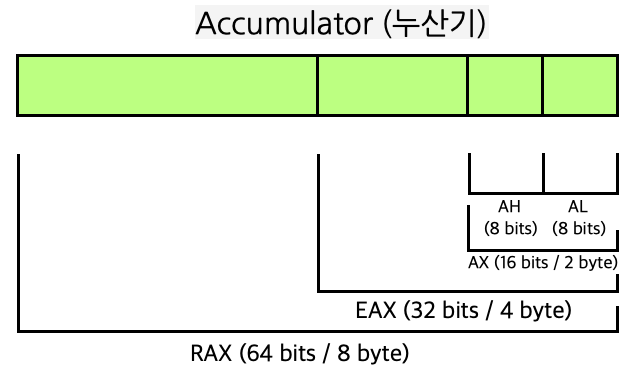

# libasm (어셈블리어로 라이브러리 만들기)

## 어셈블리어란?

어셈블리어는 여러 코딩 언어가 나오기 전 기계어 (숫자)로만 프로그램을 만들 때 보기 편하라고 만든 언어이다.

예를 들어서 아주 간단한 기능을 c언어로 만든다 생각해보자.

```c
int a;
int b;
int c;
a = 1;
b = 2;
c = a + b;
```

a와 b라는 정수형 변수에 각각 1, 2를 할당하고 c라는 변수에 a와 b를 더한 값을 집어넣는 코드다. 만약에 위 코드를 기계어로 작성한다면

```
c7 45 fc 00 00 00 00
c7 45 f8 01 00 00 00
c7 45 f4 02 00 00 00
8b 45 f8
03 45 f4
89 45 f0
```

이런 한눈에 봐서 대체 무슨일을 하는지 모를 코드로 작성된다. (위 c 코드를 밑 기계어로 바꾸는 것을 "컴파일" 이라고 한다.)

위처럼 숫자로 프로그램을 만들면 유지보수가 너무 힘들기 때문에 어셈블리어를 사용한다.

```assembly
mov    DWORD PTR [rbp-0x4],0x0 ; 스택에 4바이트 길이의 0을 저장 (위에서 'c' 변수)
mov    DWORD PTR [rbp-0x8],0x1 ; 스택에 4바이트 길이의 1을 저장 (위에서 'a' 변수)
mov    DWORD PTR [rbp-0xc],0x2 ; 스택에 4바이트 길이의 2을 저장 (위에서 'b' 변수)
mov    eax,DWORD PTR [rbp-0x8] ; eax 라는 cpu 레지스터에 a 변수를 꺼내옴
add    eax,DWORD PTR [rbp-0xc] ; eax 라는 cpu 레지스터에 b 변수를 더함
mov    DWORD PTR [rbp-0x4],eax ; c 변수에 eax 레지스터 저장
```

위 기계어 코드 줄(각각 한 줄이 하나의 명령어를 의미한다.)이랑 어셈블리어 코드 줄이랑 1:1 대응이 되는 것이다.

딱 보기에 되게 의미없이 적어놓은 것 같은 위 기계어에서도 비트 필드당 의미하는 일종의 문법이 있다.

8b 45 f8 -> 이렇게 써있는거도 비트 단위로 분석해보면 opcode (값을 더하거나 빼거나 하는 동작을 의미함. opreation code), 연산을 할 대상 등이 들어 있으며 사람이 이를 일일히 분석하여 코드를 작성하거나 유지보수를 하기 너무 어려우므로 어셈블리를 사용하는 것이다.

## C나 자바 등을 놔두고 복잡하고 어려운 어셈블리어를 사용하는 이유는?

어셈블리어 자체는 현재 점유율 11위로 생각보다 널리 또 많이 사용되는 언어이다.

여러가지 이유가 있겠지만 C나 자바등을 이용해서 컴파일을 하면 컴파일러가 임의로 최적화를 하거나 하기 때문에 의도치 않은 동작을 수행하거나 더 느려질 수 있다.

예를 들어 위 C 코드에서는 변수의 선언과 연산을 따로따로 하였지만 기계어로 번역된 결과를 보면 선언과 연산을 동시에 한 것을 볼 수 있다.

최근엔 cpu 성능이 좋아 성능을 위해서 어셈블리어로 코딩을 할 필요는 없지만 컴파일러가 의도치 않은 최적화 등을 하면 예기치않은 문제가 발생할 수 있기 때문에 CPU에서 구동되는 동작을 명령어 단위로 확인해야 하거나 컴파일러를 거치지 않고 직접 그 동작을 정하고 싶을 때에는 어셈블리어를 사용한다.

예를 들면 보안, 해킹, 드라이버 개발 등 여러 분야가 있을 것이다. (특히 해킹 분야에서 많이 사용되는 것으로 알고 있다.)

최근에는 웹 프론트앤드 분야에서도 웹어셈블리 라는 개념으로 부분적으로 사용된다고 한다. 웹어셈블리를 사용할 때 어셈블리어로 직접 코딩하진 않겠지만 어셈블리 관련 지식이 적당히 있어야 할 것으로 보인다.

하지만 어셈블리어로 함수나 기능 몇개가 아니라 프로그램 전체를 만드는 것은 엄청나게 비효율적인 일이므로 특수한 직종이 아니면 어셈블리어를 빠삭하게 알 필요는 없고 어셈블리어가 어떤 것인지 적당히 알기만 하면 도움이 될 것이다. (libasm도 이런 의도로 출제한 과제로 보임)

## C언어로 컴파일 한 실행파일의 어셈블리어 보기

컴파일을 하면 기존 소스코드는 기계어로 변환된다. 이 기계어를 objdump라는 프로그램을 이용하면 어셈블리어로 볼 수 있다. C언어의 로직이 어셈블리어로 어떻게 바뀌는지 참조할 때 유용하다.

```
# 컴파일 (실행파일 자체가 기계어임)
$> gcc main.c
# 기계어를 어셈블리어로 보기 (리눅스)
$> objdump -d -M intel ./a.out
# 기계어를 어셈블리어로 보기 (맥os)
$> objdump -d --x86-asm-syntax=intel a.out
```

## 어셈블리어 아주 기초 문법

### 어셈블리어 기본 문법

어셈블리어는 한줄 한줄 하나의 명령으로 이루어진다. 따라서 명령 한줄한줄은 간단한 편이다.

명령 자체도 매우 단순한 명령(더하기 빼기 메모리로/메모리에서 값 옮기기 등)밖에 없어 명령 자체로는 별 어려울 게 없다.

어셈블리어의 명령은 주로 다음과 같이 이루어져 있다.

```assembly
opcode                    ; 인자 없이 명령만 실행
opcode operand1           ; 인자를 하나만 받음
opcode operand1 operand2  ; 인자를 두개 받음
```

### opcode (명령어)

위에 어셈블리어 예제를 보면 mov, add와 같은 문자가 있다. 이것이 opcode이다.

어셈블리어는 opcode가 명령을 나타내며 무슨 동작을 할 지를 의미한다.

opcode는 기계어에서 명령어를 의미하고 어셈블리어에서 명령어는 mnemonic(니모닉) 이라고 부른다.

### operand (인자)

operand는 오퍼랜드라고 읽으며 해당 명령어 (opcode)가 명령어를 어떤 대상에 수행할지를 나타낸다.

### 예제

예를 몇가지 들어보자.

```assembly
syscall       ; 시스템 콜 호출
cmp [addr], 0 ; addr이 가리키는 메모리 값과 0을 비교
mov a, b      ; b 레지스터의 값을 a로 이동 (복사)
add a, b      ; a 레지스터에 b 값을 더함
```

위에서 syscall, cmp, mov, add 가 무슨 명령을 실행할 지 나타내는 opcode가 되고 뒤에 값들이 오퍼랜드이다.

오퍼랜드에는

- 메모리 값
- 상수
- 레지스터

등이 올 수 있다.

## libasm

### 요구사항

- asm 파일 및 Makefile을 이용하여 libasm.a (정적 라이브러리) 를 만들 수 있어야 함.
- asm 파일의 확장자는 .s임.
- 어셈블리어의 컴파일러는 nasm을 사용해야 한다.
- Intel 문법을 사용해야 함.
- 64비트 양식으로 작성해야 하며 "calling convention"을 숙지
- Makefile을 작성해야 하며 가지고 있어야 하는 명령어는 기존과 동일, 보너스도 마찬가지
- 프로젝트에 대한 테스트 프로그램(코드)는 선택사항으로 제출하며 이를 이용해 defense 하면 편함. 테스트 프로그램에서는 궂이 코딩룰을 지킬필요 없음 (근데 테스트를 위한 main 함수는 함께 제출하라고 함. 뭐지?)
- 인라인 ASM을 작성하면 안됨
- syscalls 도중에 에러가 발생하는지 반드시 체크해야 하며 필요시 에러 관리
- errno 변수를 적절하게 관리 (이를 위해 extern ___error 호출 허용)

### 구현해야 하는 함수

- ft_strlen (man 3 strlen)
- ft_strcpy (man 3 strcpy)
- ft_strcmp (man 3 strcmp)
- ft_write (man 2 write)
- ft_read (man 2 read)
- ft_strdup(man 3 strdup, malloc을 call할 수 있습니다.)

## 요구사항 분석하며 과제 진행하기

### nasm 사용해보기

gcc(lldb) 가 아닌 nasm 이라는 컴파일러?를 사용하라 한다. 우선 구글링을 통해 nasm 튜토리얼을 찾아본다.

[https://cs.lmu.edu/~ray/notes/nasmtutorial/](https://cs.lmu.edu/~ray/notes/nasmtutorial/)

추가로 현재 개발환경에서 nasm이 설치되어 있지 않다면 설치한다. (apt-get 혹은 brew를 이용해서 설치한다.)

튜토리얼 사이트에 들어가면 hello world 예제가 나오는데 해당 예제를 실행해보자.

```assembly
; ----------------------------------------------------------------------------------------
; Writes "Hello, World" to the console using only system calls. Runs on 64-bit macOS only.
; To assemble and run:
;
;     nasm -fmacho64 hello.asm && ld hello.o && ./a.out
; ----------------------------------------------------------------------------------------

          global    start

          section   .text
start:    mov       rax, 0x02000004         ; system call for write
          mov       rdi, 1                  ; file handle 1 is stdout
          mov       rsi, message            ; address of string to output
          mov       rdx, 13                 ; number of bytes
          syscall                           ; invoke operating system to do the write
          mov       rax, 0x02000001         ; system call for exit
          xor       rdi, rdi                ; exit code 0
          syscall                           ; invoke operating system to exit

          section   .data
message:  db        "Hello, World", 10      ; note the newline at the end
```

```sh
$> nasm -fmacho64 hello.s && ld -macosx_version_min 10.7.0 hello.o && ./a.out
```

해당 어셈블리 코드로 작성된 파일을 컴파일하면 오브젝트(hello.o)파일이 생성된다.

c 파일을 컴파일 할 때 도중에 나오는 o 파일과 동일하며 이를 실행 파일로 만들기 위해선 링커 (ld) 명령어를 이용해서 링크한 후 실행파일 (a.out) 으로 만들어야 한다.

nasm에서 -fmacho64 옵션은 맥os 상에서 구동되는 64비트 환경으로 컴파일하라는 의미이다.

참고로 위에서 사용했던 objdump 명령어를 이용하면 컴파일 된 오브젝트 파일이나 실행파일을 역으로 디컴파일 할 수 있다.

```shell
objdump -d --x86-asm-syntax=intel hello.o

hello.o:  file format Mach-O 64-bit x86-64


Disassembly of section __TEXT,__text:

0000000000000000 start:
       0: b8 04 00 00 02                 mov  eax, 33554436
       5: bf 01 00 00 00                 mov  edi, 1
       a: 48 be 00 00 00 00 00 00 00 00  movabs  rsi, 0
      14: ba 0d 00 00 00                 mov  edx, 13
      19: 0f 05                          syscall
      1b: b8 01 00 00 02                 mov  eax, 33554433
      20: 48 31 ff                       xor  rdi, rdi
      23: 0f 05                          syscall
```

오퍼렌드 명칭이 약간 다른 것을 제외하면 거의 비슷한 것을 볼 수 있다. 이는 본질적으로 직접 실행되는 기계어와 어셈블리어가 거의 같음을 보여준다.

튜토리얼에 없는 옵션 -macosx_version_min 10.7.0을 붙인 이유는 맥os에서 하이시에라 os 버전부터 main이 없는 코드의 실행을 불가능하게 바꿔 이전 버전으로 컴파일 하는 것이다. 추후에 라이브러리를 만들 때에는 해당 옵션을 붙일 필요 없다.

어셈블리어로 라이브러리를 만드는 데는 메인 함수가 필요 없으므로 해당 부분은 명확히 알 필요 없다.

### nasm에서 사용하는 어셈블리어 기본 문법

어셈블리어는 컴파일러나 CPU에 따라 문법이 조금씩 다르다. 하지만 기본적인 틀은 비슷하다. nasm에서 사용하는 어셈블리어 문법을 보자.

참조 : [https://www.tutorialspoint.com/assembly_programming/assembly_basic_syntax.htm](https://www.tutorialspoint.com/assembly_programming/assembly_basic_syntax.htm)

어셈블리어로 코딩할 때 코드는 크게 3가지 부분으로 나누어진다.

- .data
- .bss
- .text

#### .data

초기값이 존재하는 상수가 들어간다. 실행 도중 여기에 있는 데이터는 변화하지 않는다. 버퍼 사이즈, 상수값 등을 여기에 저장한다.

#### .bss

초기값이 없는 변수가 여기에 들어간다. 상수가 아닌 변수가 여기에 들어간다.

#### .text

실제 어셈블리 코드가 여기에 들어간다. text 섹션 시작 바로 직전에 global [라벨명] 을 집어 넣어 코드의 시작 부분을 명시한다.

#### 주석

nasm 에서 주석은 세미콜론을 이용해 단다.

#### 명령어 한줄한줄

```
[label]   mnemonic   [operands]   [;comment]
```

위 어셈블리어 아주기본에서 보다시피 명령어 핵심 구성요소는 미모닉(opcode)과 오퍼랜드이다. 라벨과 주석은 선택사항이다.

### 메모리

메모리 접근은 대괄호를 이용해서 한다.

필요시에 대괄호 앛에 크기를 명시해야 한다.

#### 예제

```assembly
MOV BYTE [메모리주소], 데이터 ; 메모리 주소가 가리키는 곳에 데이터 삽입
MOV QWORD [메모리주소], 데이터 ; 메모리 주소가 가리키는 곳에 8바이트 데이터 삽입
```

### 레지스터

레지스터는 CPU 내부에 있는 저장장치이다. 레지스터에 대한 접근 속도는 메모리에 대한 접근 속도보다 훨씬 빠르므로 꼭 필요한 경우가 아니면 레지스터에 접근을 하여 연산한다.

레지스터는 단순히 값을 잠시 저장하는 것 뿐만이 아니라 여러 가지 다른 기능도 수행한다.

레지스터를 분류하면 다음과 같다. (세부적인 레지스터의 명칭과 기능은 CPU 제조사마다 다르다.)

### 범용 레지스터 (Intel 64bit CPU 기준)

범용 레지스터는 주로 사용되는 부분이 있지만 반드시 해당 용도로 사용되어야 하는 것은 아니며 다른 용도로 사용될수도 있다.

- 데이터 레지스터 (밑 4가지 레지스터가 대표적이다.)
  - Accumulator (누산기, 산술 연산에 사용)
  - Base (주소 지정에 사용)
  - Count (반복문 카운트)
  - Data (Data I/O)
- 64비트 CPU에서는 64비트 길이를 가지며 32비트 CPU에서는 32비트 길이를 가진다.
- 레지스터의 명칭을 바꾸어 다른 길이로 접근이 가능하다.
  - Accumulator, Base, Count, Data 각각 앞 알파벳을 따서 A, B, C, D로 구분하는 것을 기본으로 앞뒤에 접두사를 붙여 길이를 구분한다.
    - R@X - E@X - @X - @H - @L (@ = A, B, C, D)
      [64비트] - [32비트] - [16비트] - [16비트의 왼쪽 8비트] - [8비트]
    - 예를 들어 64비트의 누산기 레지스터는 RAX이며 16비트 카운트 레지스터는 CX이다.
    - 
  - 위 4가지 레지스터는 원래 본 기능이 존재하지만 다른 용도로도 많이 사용한다. (예를 들면 시스템 콜)
- 포인터 레지스터
  - 메모리의 주소를 가리킨다.
    - IP (Instruction Pointer, 명령어 포인터) : 다음에 실행될 명령어가 들어있는 메모리 주소를 가리킨다.
    - SP (Stack Pointer) : 프로그램이 사용하는 스택 메모리의 주소를 가리킨다.
    - BP (Base Pointer) : 스택의 특정 기준점을 의미함.
  - 64비트에서 각 포인터는 RIP, RSP, RBP이다.
  - 보통 서브 루틴의 지역 변수는 스택에 저장되기 때문에 C에서 지역변수를 선언하면 해당 변수는 스택에 쌓이게 된다.
- 인덱스 레지스터
  - 보통 메모리에 일렬로 저장된 데이터에 접근 시 사용함.
  - SI (Source Index)
  - DI (Dest. Index)

### 제어 레지스터

- 플래그 형태로 사용하며 산술연산을 할 때에나 인터럽트 사용 여부 등을 정할 수 있다.
- 산술 연산을 할 때 오버플로우가 발생하거나 연산 결과가 짝수이거나 등을 플래그로 확인할 수 있다.

### 세그먼트 레지스터

- 프로그램에서 메모리의 어떤 부분이 사용되는지 명시한다. 예를 들면 코드 영역 / 데이터 영역 / 스택 영역이 메모리에서 구분되는데 이런 구분을 하기 위해서 사용한다.

### Syscall

- System Call = syscall
- 운영 체제(커널)가 기본적으로 제공하는 서비스가 있음. (화면에 글자 출력하는것부터 파일 열고 닫기, 통신 등등)
- 예를 들어 printf나 write 함수를 사용해서 쉘에 글자를 출력하는 것은 printf나 write 라는 표준 함수를 이용해서 화면에 출력하는 것이지 사용자가 직접 화면에 픽셀을 바꿔서 글자를 출력하는 것이 아님.
- 왜냐 하면 그런 일들은 운영체제(커널)가 할 수 있는 일임. system call은 커널에 그런 것을 하도록 요청하는 것임.
- 어셈블리어로 코딩을 할 때에 화면 입출력, 파일조작 등 시스템 기능에 접근해야 할 일이 있을 때 Syscall을 이용한다.

### NASM에서 시스템콜 사용하기

1. 누산기 레지스터 (RAX)에 시스템 콜 넘버를 집어넣는다.
2. 시스템 콜 매개변수를 Base, Count, Data 등 CPU 레지스터에 집어넣는다.
3. System Call 명령을 실행한다. (참고로 32비트 환경에서는 int 0x80 명령어로 시스템 콜을 호출한다.)
4. System Call 명령이 실행되고 반환된 결과는 보통 누산기 레지스터에 저장된다.

## 서브루틴 (함수) 호출

참고 : [https://refspecs.linuxbase.org/elf/x86_64-abi-0.99.pdf](https://refspecs.linuxbase.org/elf/x86_64-abi-0.99.pdf) 22p

참고2 : [http://6.s081.scripts.mit.edu/sp18/x86-64-architecture-guide.html](http://6.s081.scripts.mit.edu/sp18/x86-64-architecture-guide.html)

함수 콜 명령어는 call (시스템콜일경우 syscall)을 이용해 서브루틴(함수)을 호출한다.

함수에 입력되는 인자 혹은 리턴값이 있을 때 서브루틴에 인수를 넘겨주거나 인수를 받아야 한다.

입력되는 인수 개수가 6개 이하이고 전부 다 정수값을 가진다면 DI-SI-Data-Count-R8D-R7D 순서대로 인수를 집어넣고 함수를 호출한다. 인수가 6개를 넘어갈 때에는 스택에 변수를 집어 넣는다.

인수에 소수 값이 있을 경우 XMM0 ~ XMM7에 순서대로 삽입한다.

이후 call 명령을 통해 서브루틴으로 건너뛴다.

함수의 리턴값은 누산기 레지스터에 들어간다. (반환하는 자료형 길이에 따라 R@X - E@X - @X - @H - @L 식으로 명칭이 바뀌는것을 기억하자.)

### NASM에서 변수 선언

보통 변수 이름 - 변수 형식 - 변수 (,로 구분되는 변수가 여러개 올 수 있음.)로 선언한다.

예로 들면

```assembly
message:  db        "Hello, World", 10
```

message : 이름

db : 변수 형식

"Hello, World", 10 : "Hello, World\n"

가 된다.

db, dw, dd, dq, dt는 순서대로 바이트, 워드(2바이트), 더블워드(4바이트), 쿼드워드(8바이트), 10바이트 이다.

## 예제 프로그램 뜯어보기

```assembly
          global    start

          section   .text
start:    mov       rax, 0x02000004     ; write() 기능을 하는 시스템 콜을 사용하기 위해
                                        ; 누산기 레지스터에 sys/syscall.h에 명시되어 있는
                                        ; (SYS_write) 값을 집어넣음
                                        ; write(int fildes, const void *buf, size_t nbyte);
          mov       rdi, 1              ; fildes에 정수 1 대입
          mov       rsi, message        ; *buf에 출력할 메모리 주소 대입
          mov       rdx, 13             ; nbyte에 출력할 바이트 길이 대입
          syscall                       ; 시스템 함수 콜
          mov       rax, 0x02000001     ; exit(int status);
          xor       rdi, rdi            ; status에 0 대입 (mov rdi, 0 과 동일함.)
          syscall                       ; 시스템 콜

          section   .data
message:  db        "Hello, World", 10  ; "Hello, World\n"
```

### 동일한 기능을 C언어로 표현

```c
#include <unistd.h>
#include <stdlib.h>
int main(void)
{
  char  message[13] = "Hello, World\n";
  write(1, message, 13);
  exit(0);
  return (0);
}
```

### 라벨

위에서 start: , message: 가 라벨이다. 이 값은 컴파일 하고 나면 저 명령어가 들어있는 주소로 변경된다.

### 시스템 콜과 표준 함수와의 관계

위에서 대충 설명했다시피 콘솔창에 입출력하는것과 프로그램을 종료하는 것은 사용자가 만든 프로그램이 직접 할 수 없으므로 운영체제한테 위탁하는 식으로 처리한다. C로 코딩하면 그러한 행동을 운영체제(커널)한테 위탁해 주는 함수가 write() 함수와 exit() 함수이다.

그런데 위 어셈블리어를 컴파일해서 바이너리로 만든 것과 밑에 적어둔 C로 작성한 코드를 컴파일해서 바이너리로 만든 것을 각각 디스어셈블(디스어셈블이란 역어셈블 즉 기계어를 어셈블리어로 바꾸는것을 말한다. 그래서 사실 어셈블리어를 컴파일한다라는 표현보다 어셈블리어를 어셈블한다는 것이 더 정확한 표현일 것이다.) 해보면 함수를 call 하는 부분이 특히 다른것을 볼수있다.

위 코드를 gcc(clang)로 컴파일 후 디스어셈블 한 결과는 다음과 같다.

```shell
$> gcc -o test main1.c
$> ./test
Hello, World
$> objdump -d --x86-asm-syntax=intel test
```

```assembly
0000000100003f20 _main:
100003f20: 55                                    push  rbp ; 함수 프롤로그
100003f21: 48 89 e5                              mov  rbp, rsp ; 함수 프롤로그
100003f24: 48 83 ec 20                           sub  rsp, 32 ; 32바이트의 스택을 해당루틴에서 사용
100003f28: c7 45 fc 00 00 00 00                  mov  dword ptr [rbp - 4], 0 ; 4바이트의 지역변수에 0 저장
100003f2f: 48 b8 2c 20 57 6f 72 6c 64 0a         movabs  rax, 748842676800397356 ; 특정 상수를 누산기에 저장
100003f39: 48 89 45 ed                           mov  qword ptr [rbp - 19], rax ; 8바이트의 지역변수에 누산기 값 저장
100003f3d: 48 b8 48 65 6c 6c 6f 2c 20 57         movabs  rax, 6278066737626506568 ; 특정 상수 2를 누산기에 저장
100003f47: 48 89 45 e8                           mov  qword ptr [rbp - 24], rax ; 8바이트의 다른 지역변수에 누산기 값 저장
100003f4b: bf 01 00 00 00                        mov  edi, 1 ; write()의 첫번째 인수
100003f50: 48 8d 75 e8                           lea  rsi, [rbp - 24] ; write()의 두번쨰 인수 (위 특정 상수가 문자열 메모리 위치인듯)
100003f54: ba 0d 00 00 00                        mov  edx, 13 ; write()의 세번째 인수
100003f59: e8 12 00 00 00                        call  18 <dyld_stub_binder+0x100003f70> ; 동적 라이브러리에서 함수 호출
100003f5e: 31 ff                                 xor  edi, edi ; exit()의 첫번째 인수 (레지스터에 0 대입할때는 mov보다 xor을 주로씀)
100003f60: 48 89 45 e0                           mov  qword ptr [rbp - 32], rax ; write()의 리턴값을 8바이트의 지역변수에 저장
100003f64: e8 01 00 00 00                        call  1 <dyld_stub_binder+0x100003f6a> ; 동적 라이브러리에서 함수 호출
```

C언어를 컴파일러가 자동으로 컴파일한 것이기 때문에 불필요한 코드가 몇개 붙긴 했지만 핵심 기능은 동일하다.

100003f20 부터 100003f21 까지 (위 두줄)는 함수를 실행할 때 붙어야 하는 구문이다. (반드시 필요한 것은 아니다. 자세한건 함수 프롤로그/에플로그 검색)

100003f24는 32바이트 크기의 지역변수를 사용할 것이기 때문에 스택포인터에 해당 공간을 확보하는 것이다. (자세한건 '지역변수  스택' 등 키워드로 인터넷 검색)

100003f28 부터 100003f47 까지는 message 변수를 만들어 그 안에 메세지 주소를 집어 넣는 부분때문에 추가된 것이다.

보면 dword ptr [rbp - 숫자] 하는 부분이 있는데 r은 크기를 나타내는 일종의 접두사이고 bp는 스택 베이스 포인터이다. C에서 지역변수는 스택에 저장되기 때문에 스택 메모리에 접근하는 것이다. 해당 부분은 C언어로 치면 지역 변수에 접근하는 것이다.

100003f4b 부터 100003f54 까지 3줄이 함수를 호출하기 전 함수 인수에 값을 넣는 과정이다.

100003f50에 mov 대신 lea 명령어가 사용되었는데 두 명령어의 역할은 비슷하다. (자세한건 검색하면 나온다.)

가장 다른 점이 syscall 대신 일반 call 명령어가 사용되었다는 건데 시스템 콜을 사용하지 않고 다른 라이브러리 내의 함수를 호출해서 사용하는 것을 볼 수 있다. (일반적으로 C같은 고급언어 내에서 보안 등 문제로 시스템 기능을 직접 제어하지 못하기 하기 위해 그런 것으로 보인다.)

### 시스템 콜 레퍼런스

하지만 우리는 직접 시스템 콜을 이용해서 라이브러리를 만들 것인데 이런 시스템 콜은 어디서 정보를 얻을 수 있을까?

일단 시스템 콜이 정확히 무엇인지를 다시 생각해보자.

### 시스템 콜 (운영체제)

참조 : [https://fjvbn2003.tistory.com/306](https://fjvbn2003.tistory.com/306)

시스템 콜을 이해하려면 먼저 운영체제가 유저 영역과 커널 영역이 분리되어 동작되는 것을 이해해야 한다.

우리가 키보드나 마우스로 실행하는 모든 프로그램은 유저 영역에서 프로그램이 구동된다. 하지만 우리가 컴퓨터를 켜면 화면이 나오고 컴퓨터가 뭔가 내부적으로 잘 동작되는 것을 알 수 있다. 이런 운영체제 내부에서 동작되는 것은 커널 모드에서 동작되는 것이며 이런 것들을 유저 영역에서 함부로 다룰 수 없다. (운영체제가 오동작 하거나 하는 문제 등 여러 문제가 있다.)

자세한 것은 컴퓨터 공학-운영체제에 대해서 별도로 공부해야 할 것이다.

아무튼 커널 영역에서만 동작되어야 하는 파일 열기 닫기나 읽기 쓰기 프로세스 종료 이런것들은 일반 프로그램이 직접 수행할 수 없기 때문에 시스템 콜을 이용해 운영체제 커널 영역에서 동작하는 프로그램에게 해달라고 대리를 부탁하는 것이다.

C나 C++ 에서 시스템 콜 함수는 그냥 write(); exit() 이렇게 사용하면 되는데 어셈블리어 에서는 어떻게 사용하는 것이 문제가 되었다.

### *nix, 어셈블리어 환경에서 시스템 콜 호출

"linux 64bit system calls in assembly" 와 같은 문장을 구글링 해보면 <sys/syscall.h> 내에 명시가 되어 있다고 한다.

[https://filippo.io/linux-syscall-table/](https://filippo.io/linux-syscall-table/) 의 링크에 따르면 C에서 사용하던 시스템 콜과 RAX 레지스터에 입력해야 하는 번호와 매칭이 되는 테이블이 있다.

위 예시를 보면 Mac OS 환경에서는 RAX 레지스터에 어떤 값을 더해야 하는 것으로 보인데 해당 이유는 [https://stackoverflow.com/questions/48845697/macos-64-bit-system-call-table](https://stackoverflow.com/questions/48845697/macos-64-bit-system-call-table) 에 나와있다. Mac OS에서는 시스템 콜 번호를 별도로 구분해놓았으며 매직넘버 0x2000000을 OR 연산 한 값을 RAX 레지스터에 삽입해야 정상적으로 시스템 콜 호출이 된다고 한다.

### 어셈블리 명령어

어셈블리 명령어는 많은 종류가 있다. 또 CPU마다 명령어가 다르고 명칭도 다르기 때문에 모든 명령어를 외우는 것은 비효율적이다. 하지만 범용적으로 사용되는 명령어 몇개가 있다.

명령어 레퍼런스는 인텔에서 (개발환경이 인텔 64비트 CPU이므로 인텔 레퍼런스를 참조해야한다.) [https://www.intel.com/content/dam/www/public/us/en/documents/manuals/64-ia-32-architectures-software-developer-instruction-set-reference-manual-325383.pdf](https://www.intel.com/content/dam/www/public/us/en/documents/manuals/64-ia-32-architectures-software-developer-instruction-set-reference-manual-325383.pdf) 다음과 같이 레퍼런스를 제공한다.

그래서 처음에는 다른 프로그램 예제들을 보고 구현하고자 하능 기능이 있을때 찾아서 사용하는 것이 효율적인것 같다.

나는 먼저 C로 컴파일 한 후 생성된 바이너리를 역어셈블 하여 내가 사용한 연산 혹은 기능에 어떤 명령어가 사용되는지 확인하여 이게 무슨 명령어인지 레퍼런스 혹은 구글링으로 찾아보는 방법을 사용했다.

#### 산술연산

- a에 1을 더함 : inc a
- a에 1을 뺌 : dec a
- a에 b를 더함 : add a, b
- a에 b를 뺌 : sub a, b
- a에 b를 곱함 : mul a, b (mul 외에 여러 변형이 있을 수 있음)
- a에 b를 나눔 : div a, b (div 외에 여러 변형이 있을 수 있음)
- a에 b를 나는 나머지 : 별도 명령어가 없고 나누면 나머지 값이 별도 레지스터에 저장됨

#### 스택 연산

CPU 내부에서는 스택을 사용한다. (스택 메모리 자체가 CPU 내에 있는게 아니라 스택 포인터를 이용해 외부 메모리에 접근하는 식이다.)

- 스택에 값 a 넣기 : push a
- 스택에서 값 a 빼기 : pop a

#### 값 대입

- a에 b값 넣기 : mov a, b

#### 값 비교 후 분기

- cmp 명령어로 비교함 : cmp a, b
- 비교한 결과는 플래그 레지스터에 저장됨
- jXX 명령어로 원하는 부분으로 분기함

#### 서브루틴 호출 및 복귀

- 일반 서브루틴 호출 : call [서브루틴]
- 시스템 콜 호출 : syscall (단 시스템 콜을 사용하기 전에 특정 레지스터에 시스템 콜 번호를 넣어야 함)
- 종료 후 이전 루틴으로 복귀 : ret
- 보통 서브루틴의 리턴값은 누산기 레지스터에 저장한다.

## 어셈블리어로 모듈 만들어보기

앞서 nasm으로 어셈블리 코드를 컴파일하면 .o 파일이 생성된다. .o 파일은 C로 컴파일할 때에도 중간과정에서 생성되는 파일이다.

object 파일은 쉽게 말하면 C 파일을 기계어로 변환한 코드이며 C 파일에 들어있는 함수명(이런건 심볼정보에 해당), 컴파일된 기계어 코드, 데이터 등이 들어있다.

따라서 어셈블리어로 모듈을 만들 때 적당히 global로 현재 기능하는 코드에 심볼을 할당하고 로직을 작성하면 이것이 모듈이 된다.

### 모듈 예제

```assembly
;func.s / char  genascii(void);
global    _genascii

section    .text
_genascii:      MOV    AL, 119      ; 누산기 레지스터에 리턴할 값을 집어넣음. (119 -> ascii 'w')
                RET                ; return
```

```c
// main.c
#include <stdio.h>
char  genascii(void);
int main(void)
{
  char c;
  c = genascii();
  printf("%c\n", c);
}
```

```shell
$> nasm -fmacho64 func.s
$> gcc main.c func.o
$> ./a.out 
w
```

어셈블리어에서 함수명 심볼에 언더바를 붙이는 이유는 간단하게 설명하면 C에서 어셈블리로 컴파일하거나 어셈블리로 컴파일 된 함수를 호출할 때에는 앞에 언더바를 붙이는 것이 일종의 규칙이다.

어셈블리 명령어나 레지스터명은 대소문자를 가리지 않는다,

### 모듈 예제 2

```assembly
;addascii.s / char  addascii(char);
global    _addascii

section    .text
_addascii:      MOV    AL, DIL    ; 입력 인수를 누산기 레지에 더함
                CMP    AL, 'a'    ; 누산기에 저장된 입력 인수와 ascii 'a'와 비교
                JL    rtn        ; 저 아스키 코드보다 작으면 종료 루틴으로 건너뜀
                CMP    AL, 'z'    ; 누산기에 저장된 입력 인수와 ascii 'z'와 비교
                JG    rtn        ; 저 아스키 코드보다 크면 종료 루틴으로 건너뜀
                INC    AL        ; 아스키 코드 1 증가
                JMP    rtn        ; 리턴 루틴으로 건너뜀

rtn:            RET              ; 종료
```

```c
// main.c
#include <stdio.h>
char    addascii(char c);
int      main(void)
{
  char  ct;
  for (char c = 'a'; c < 'z'; c++)
  {
    ct = addascii(c);
    printf("%c -> %c\n", c, ct);
  }
  for (char c = 'A'; c < 'Z'; c++)
  {
    ct = addascii(c);
    printf("%c -> %c\n", c, ct);
  }
}
```

```shell
$> nasm -fmacho64 addascii.s
$> gcc main.c addascii.o
$> ./a.out 
[소문자 알파벳은 다음 문자가 더해지고 대문자 알파벳은 그대로 출력됨]
```

소문자 알파벳을 입력받아 다음 인덱스에 있는 아스키 코드를 반환하고 소문자 알파벳 범위에 있지 않을 경우 입력 값 그대로 반환하는 예시이다.

### errno와 errno.h

요구사항을 보면 errno 변수를 상황에 맞게 set해야 한다고 한다. 먼저 errno가 무엇인지 알아야 한다.

errno는 errno.h 헤더파일에 정의된 static int 변수이다. errno.h는 C 표준 라이브러리에 존재한다.

errno의 목적은 프로그램 코드 (특히 시스템 콜 함수)실행 시 여러 에러가 발생했을 때 에러 내용을 errno에 기록하여 무슨 에러가 발생했는지 확인하기 위함이다.

위에서 말하는 모든 함수에 대해 errno를 적용할 필요는 없다. 표준 함수를 재구현 하는 것이기 때문에 표준함수 메뉴얼에 error 항목에 따라 설정하면 된다.

자세한 내용은 man errno 참조

### ___error ?

요구사항에 추가로 __error 함수가 호출될 수 있다고 한다. errno와 error 함수의 관계를 알아야 한다.

구글이 "apple errno.h" 라고 검색하면 errno.h 소스코드를 볼 수 있는데 소스코드 내에 errno의 정의를 확인할 수 있다.

```c
#define errno (*__error())
```

errno의 정체는 __error() 함수의 반환값이 가리키는 메모리 영역이다.

기존 C에서 시스템 콜을 사용할 때 에러 발생 시 자동으로 errno가 set된다고 하니 errno 변수는 __error() 함수의 반환값이 가리키는 포인터 값이 되는 것으로 보인다.

## strlen 구현

strlen을 구현해보자.

strlen을 구현하기 전 먼저 환경 구성부터 해보자.

### 필요 파일

Makefile - nasm으로 *.s 파일이 *.o 파일로 컴파일되도록 해야 하며 ar 명령어를 이용하여 정적 라이브러리로 만들도록 해야 한다.

ft_strlen.s - 소스 코드

libasm.h - 라이브러리를 생성하는 데에는 필요 없지만 해당 라이브러리를 다른 프로젝트에서 사용할 때 필요하다. 예를 들어 main 함수를 만들어 테스트를 해야 하는데 필요하다.

main 함수를 포함한 C 파일 - main 함수를 이용해서 테스트 케이스를 보여줘야 하므로 필요하다.

```makefile
%.o: %.s
  $(ASMCOMPILER) $(ASMFLAGS) $<

$(NAME): $(OBJS)
  ar rc $(NAME) $(OBJS)
  ranlib $(NAME)
```

Makefile의 일부분이다. 이런 식으로 작성하면 된다.

### man 3 strlen

man 3 strlen에 따르면 strlen의 함수의 원형은 다음과 같다. size_t는 unsigned int와 같은 의미이다.

```
size_t strlen(const char *s);
```

별다른 에러 처리는 없고 기존에 구현한 로직대로 구현하면 될 것이다.

### 주의해야 할 점

- 입력 인수는 포인터다. 포인터의 길이는 64비트다. (현재 개발환경이 cpu가 64비트임. 그러면 메모리 주소의 길이도 64비트이다. 따라서 입력 인수를 받을 때 64비트-8바이트 QWORD 길이로 받아야 한다.)
- 카운트 변수 + 입력 인수로 메모리에 접근할 때 카운트 변수도 8바이트로 접근해야 한다. 하지만 리턴값은 4바이트(int)이다. 크게 문제가 되진 않는 것 같지만 추후에 다른 문제가 발생할 여지 정도는 있는것 같다.
- 카운트 할 레지스터를 XOR 연산을 이용해서 0으로 초기화 하자.

### 핵심 코드

```assembly
CMP    BYTE [RDI + RAX], 0    ; 1바이트 크기의 인수로 받은 포인터 위치 값과 0(char null) 비교
JE    rtn                    ; JE (Jump Equal) - 같으면 종료
INC    RAX                    ; 같지 않으면 누산기 레지 1 증가
```

함수호출이 끝나면 변수는 누산기 레지스터에 저장되기에 처음부터 누산기 레지스터를 카운트 변수로 삼았다.

## strcpy 구현

### man strcpy

함수의 원형 및 동작을 숙지한다.

입력 인수가 두개이므로 DI-SI 순서대로 인수가 들어오고 두개 모두 포인터이므로 RDI, RSI로 받아야 한다.

메모리 간의 mov 연산은 안된다고 하므로 다음과 같이 적으면 오류가 난다.

```assembly
MOV    BYTE [RAX], BYTE [RSI]
```

따라서 사용하지 않는 볌용 레지스터 (나는 Data 레지스터를 사용했다)로 메모리에서 값을 뽑아온 다음 레지스터의 값을 메모리에 넣는 방법을 사용해야 한다.

이런식으로 다른 레지스터를 거치도록 하여 사용하여야 한다.

```assembly
MOV    RDX, BYTE [RAX]
MOV    BYTE [RSI], RDX
```

## strcmp 구현

man 3 strcmp -> int strcmp(const char *s1, const char *s2);

나는 원래 strcmp를 다음과 같이 구현하였었다.

```c
int      ft_strcmp(char *s1, char *s2)
{
  while (!(*s1 == '\0' && *s2 == '\0'))
  {
    if (*s1 != *s2)
      return ((int)(*s1 - *s2));
    s1++;
    s2++;
  }
  return (0);
}
```

하지만 while문 내부 및 내부 if문의 순서를 생각하면 이를 어셈블리어로 짜면 복잡하기 때문에 로직을 다음과 같이 수정했다.

```c
int      ft_strcmp(char *s1, char *s2)
{
  while (*s1 == *s2)
  {
    if (*s1 == '\0')
      break ;
    s1++;
    s2++;
  }
  return ((int)(*s1 - *s2));
}
```

또 맥os에서 사용하는 strcmp는 리턴값이 아스키코드 차이가 나는 만큼의 값을 반환하는 것이 아니라 -1, 0, 1을 반환하도록 동작된다. man strcmp에도 그렇게 구현하란 내용은 없지만 동일한 동작을 하게 하기 위해 반환값은 세가지로 제한하기로 하였다.

리턴값이 integer = 4바이트 이므로 4바이트 누산기인 EAX에 값을 리턴해야 한다.

## write 구현

```c
ssize_t    write(int fildes, const void *buf, size_t nbyte);
```

ssize_t는 long과 동일한 자료형이다.

에러 처리를 구현하지 않으면 다음과 같이 매우 간단해진다.

```assembly
_ft_write:      MOV    RAX, 0x02000004  ; 시스템 콜을 사용하기 위해 누산기 레지스터에 콜 고유번호 삽입
                SYSCALL                ; 세개의 변수는 그대로 write 시스템콜에 들어가므로 별도로 삽입하지 않음.
                RET                    ; 종료
```

하지만 에러 상황에 따른 errno 설정이 필요하므로 여기에 대한 고민이 필요하다.

### extren 키워드

extern 키워드는 외부 심볼 (함수나 변수)을 현재 소스코드 내부에서 처리할 수 있도록 해주는 키워드이다.

### C에서 errno 동작 확인

예를 들어 다음과 같은 코드를 실행해보자.

```c
#include <stdio.h>
#include <sys/errno.h>
int main(void)
{
  long rtn;
  printf("errno : %d\n", errno);
  rtn = write(-1, "hi", 2);
  printf("errno : %d\n", errno);
  printf("rtn : %ld\n", rtn);
  return (0);
}
```

결과는 다음과 같다.

```
errno : 0
errno : 9
rtn : -1
```

그런데 위에 어셈블리로 짠 함수로 해보면 errno를 설정하는 로직이 없으므로 errno는 변화하지 않는다.

### 시스템 콜에서 에러 발생 시 확인하는 법

시스템 콜에서 에러가 발생할 시 error number는 리턴되지만 에러 여부는 나오지 않는다. 반환값이 음수도 아니라 이게 에러가 발생하는지 일반적인 방법으로 알 수 없다. 따라서 어셈블리 로직 내부에 에러가 발생하는 상황을 감지해 에러가 발생할 시에 -1을 리턴하도록 해야 한다.

FreeBSD를 기반으로 한 OS는 system call이 발생하는 도중 에러가 발생한다면 레지스터 중 Carry Flag를 set 한다고 한다. (출처 : [https://www.freebsd.org/doc/en_US.ISO8859-1/books/developers-handbook/x86-return-values.html](https://www.freebsd.org/doc/en_US.ISO8859-1/books/developers-handbook/x86-return-values.html))

맥OS는 FreeBSD를 기반으로 한 OS이므로 system call 시 발생하는 에러를 캐리플래그로 이용해 알아낼 수 있다.

### __error()과 errno

위에서 봤듯이 현재 구현하고자 하는 환경에서 errno는 __error() 함수가 가리키는 특정 메모리 공간이라고 한다. 또 errno는 integer 형이다. (또 다른 출처 : [https://www.freebsd.org/cgi/man.cgi?query=errno&sektion=2&manpath=freebsd-release-ports](https://www.freebsd.org/cgi/man.cgi?query=errno&sektion=2&manpath=freebsd-release-ports))

errno를 설정하기 위해 __error() 함수를 사용하고 extern을 사용하라고 했다. 이 말은 저 함수의 리턴값을 참조해 그 내부에 에러 코드를 삽입하라는 말이다.

따라서 __error 함수 호출 후 리턴되는 값은 메모리 주소 값이므로 그 메모리 주소 위치에 에러 발생 시 에러 코드를 삽입하면 된다.

## read()

위 write 함수에 대해 시스템 콜 번호만 바꾸면 된다.

## strdup()

메뉴얼에 따르면 메모리 할당에 실패하면 errno를 ENOMEM 으로 맞춰야 한다. 또 NULL을 리턴한다.

malloc 메뉴얼을 보면 메모리 할당 시 알아서 errno를 set하며 errno 부분은 별도로 설정할 필요가 없다.

### 이상한 점

구현 도중 이상한 부분에서 자꾸 세그멘테이션 오류가 발생했다.

이상할 점 없어 보이는 다음과 같은 코드를 실행할 때 세그멘테이션 오류가 발생한다.

```assembly
global    _ft_strdup
extern    _malloc

section    .text
_ft_strdup:      MOV    RDI, 10          ; malloc 입력인수 (10)
                CALL  _malloc          ; malloc 호출
                RET                    ; 종료
```

실제로 strdup 기능을 하는 코드가 아닌 단순히 malloc 동작을 테스트하기 위한 코드이다. 하지만 이 코드를 실행하면 세그멘테이션 오류가 뜬다.

자세한 오류를 알기 위해 gcc(clang)로 빌드할 때 

```makefile
-fsanitize=address -g
```

옵션을 넣어 빌드해 보았다. fsanitize=address 옵션은 메모리 오류를 감지하기 위한 디버깅 옵션이다.

오류 메세지는 다음과 같다.

```
AddressSanitizer:DEADLYSIGNAL
=================================================================
==34860==ERROR: AddressSanitizer: SEGV on unknown address (pc 0x7fff2034a3ee bp 0x7ffeeba748d0 sp 0x7ffeeba74888 T0)
==34860==The signal is caused by a READ memory access.
==34860==Hint: this fault was caused by a dereference of a high value address (see register values below).  Dissassemble the provided pc to learn which register was used.
    #0 0x7fff2034a3ee in stack_not_16_byte_aligned_error+0x0 (libdyld.dylib:x86_64+0x143ee)
    #1 0x10418c85c in main test.c:32
    #2 0x7fff2034b620 in start+0x0 (libdyld.dylib:x86_64+0x15620)

==34860==Register values:
rax = 0x00006020000000d0  rbx = 0x0000000000000000  rcx = 0x7365742079706f63  rdx = 0x0000000000000005  
rdi = 0x000000000000007b  rsi = 0x000000010418ed80  rbp = 0x00007ffeeba748d0  rsp = 0x00007ffeeba74888  
 r8 = 0x0031232074736574   r9 = 0x0000000000000000  r10 = 0xffffffffffffffff  r11 = 0x0000000104193d20  
r12 = 0x0000000000000000  r13 = 0x0000000000000000  r14 = 0x0000000000000000  r15 = 0x0000000000000000  
AddressSanitizer can not provide additional info.
SUMMARY: AddressSanitizer: SEGV (libdyld.dylib:x86_64+0x143ee) in stack_not_16_byte_aligned_error+0x0
==34860==ABORTING
```

위 오류 내용으로 알 수 있는것은 메모리 READ 작업을 하는 중 "stack_not_16_byte_aligned_error" 라는 에러가 발생했다는 것만 알 수 있다. 정확히 어느 구문에서 오류가 난지는 알 수 없다.

더 정확한 오류를 추적하기 위해 gdb(lldb)를 사용하기로 했다. 현재 vscode에서 개발하고 있는데 C만 사용했을 때는 gdb(lldb)와 자동으로 연동해주는 기능이 있었지만 어셈블리에도 그런 기능이 있는지는 모르기 때문에 그냥 쉘상에서 gdb(lldb)를 사용하기로 했다.

lldb의 기본적인 명령어는 다음과 같다.

- r (프로그램 실행)
- b [브레이크 걸 심볼] (브레이크포인트를 걸 위치 (함수명 등))
- n [한 라인씩 실행]
- q (종료)
- register read (현재 레지스터 보기)

lldb 기준으로 디버깅 사용 순서는 다음과 같다.

1. lldb [프로그램]
2. [(lldb) settings set target.x86-disassembly-flavor intel] // 출력되는 어셈 문법을 인텔 형식으로 출력
3. [(lldb) b [브레이크포인트 심볼]
4. [(lldb) r
5. (lldb) n

```
$> lldb test
(lldb) target create "test"
Current executable set to '/Users/joohongpark/Documents/code/42/42cursus/libasm/test' (x86_64).
(lldb) b ft_strdup
Breakpoint 1: where = test`ft_strdup, address = 0x0000000100002ab7
(lldb) r
Process 35058 launched: '/Users/joohongpark/Documents/code/42/42cursus/libasm/test' (x86_64)
strdup test
Process 35058 stopped
* thread #1, queue = 'com.apple.main-thread', stop reason = breakpoint 1.1
    frame #0: 0x0000000100002ab7 test`ft_strdup
test`ft_strdup:
->  0x100002ab7 <+0>:  movl   $0x7b, %edi
    0x100002abc <+5>:  callq  0x1000030f8               ; symbol stub for: malloc
    0x100002ac1 <+10>: retq   
    0x100002ac2 <+11>: movq   %rax, %rdi
Target 0: (test) stopped.
(lldb) n
Process 35058 stopped
* thread #1, queue = 'com.apple.main-thread', stop reason = instruction step over
    frame #0: 0x0000000100002abc test`ft_strdup + 5
test`ft_strdup:
->  0x100002abc <+5>:  callq  0x1000030f8               ; symbol stub for: malloc
    0x100002ac1 <+10>: retq   
    0x100002ac2 <+11>: movq   %rax, %rdi
    0x100002ac5 <+14>: subq   $0x8, %rsp
Target 0: (test) stopped.
(lldb) n
Process 35058 stopped
* thread #1, queue = 'com.apple.main-thread', stop reason = EXC_BAD_ACCESS (code=EXC_I386_GPFLT)
    frame #0: 0x00007fff2034a3ee libdyld.dylib`stack_not_16_byte_aligned_error
libdyld.dylib`stack_not_16_byte_aligned_error:
->  0x7fff2034a3ee <+0>: movdqa %xmm0, (%rsp)
    0x7fff2034a3f3 <+5>: int3   

libdyld.dylib`_dyld_fast_stub_entry:
    0x7fff2034a3f4 <+0>: pushq  %rbp
    0x7fff2034a3f5 <+1>: movq   %rsp, %rbp
Target 0: (test) stopped.
(lldb) exit
Quitting LLDB will kill one or more processes. Do you really want to proceed: [Y/n] Y
```

위 lldb 실행 결과를 보면 malloc 함수 호출 단계에서 stack_not_16_byte_aligned_error 라는 에러가 발생했다고 한다. 해당 내용을 구글링해보자.

구글링하면서 알게 된 사실이 OS X 시스템에서는 스택을 16바이트 단위로 정렬되도록 관리하여야 한다고 한다. (*16*-*byte stack* alignment) 그래서 스택 포인터가 8의 배수로 떨어져야 한다고 한다. 참고자료 : [https://stackoverflow.com/questions/43354658/os-x-x64-stack-not-16-byte-aligned-error](https://stackoverflow.com/questions/43354658/os-x-x64-stack-not-16-byte-aligned-error)

일단 위에서 스택포인터 RBP RSP를 참조해보면 (RSP-RBP) 72가 나오는데 이 값은 16으로 나누어 떨어지지 않는다. 따라서 현재 스택이 16바이트 단위로 정렬되지 않은 상태라 오류가 발생한 것으로 보인다.

### 함수의 프롤로그와 에필로그와 위 오류 수정

그러고 보니 기존 gcc(lldb) 로 C 코드를 빌드한 바이너리를 역어셈블 할  때 함수 처음과 끝에 항상 붙는 어셈 명령어가 있었다.

```assembly
0000000100003e70 _strcmp:
100003e70: 55                            push  rbp
100003e71: 48 89 e5                      mov  rbp, rsp
100003e74: 48 89 7d f8                   mov  qword ptr [rbp - 8], rdi
100003e78: 48 89 75 f0                   mov  qword ptr [rbp - 16], rsi
100003e7c: 48 8b 45 f8                   mov  rax, qword ptr [rbp - 8]
100003e80: 0f be 08                      movsx  ecx, byte ptr [rax]
100003e83: 48 8b 45 f0                   mov  rax, qword ptr [rbp - 16]
100003e87: 0f be 10                      movsx  edx, byte ptr [rax]
100003e8a: 39 d1                         cmp  ecx, edx
100003e8c: 0f 85 36 00 00 00             jne  54 <_strcmp+0x58>
100003e92: 48 8b 45 f8                   mov  rax, qword ptr [rbp - 8]
100003e96: 0f be 08                      movsx  ecx, byte ptr [rax]
100003e99: 83 f9 00                      cmp  ecx, 0
100003e9c: 0f 85 05 00 00 00             jne  5 <_strcmp+0x37>
100003ea2: e9 21 00 00 00                jmp  33 <_strcmp+0x58>
100003ea7: 48 8b 45 f8                   mov  rax, qword ptr [rbp - 8]
100003eab: 48 05 01 00 00 00             add  rax, 1
100003eb1: 48 89 45 f8                   mov  qword ptr [rbp - 8], rax
100003eb5: 48 8b 45 f0                   mov  rax, qword ptr [rbp - 16]
100003eb9: 48 05 01 00 00 00             add  rax, 1
100003ebf: 48 89 45 f0                   mov  qword ptr [rbp - 16], rax
100003ec3: e9 b4 ff ff ff                jmp  -76 <_strcmp+0xc>
100003ec8: 48 8b 45 f8                   mov  rax, qword ptr [rbp - 8]
100003ecc: 0f be 08                      movsx  ecx, byte ptr [rax]
100003ecf: 48 8b 45 f0                   mov  rax, qword ptr [rbp - 16]
100003ed3: 0f be 10                      movsx  edx, byte ptr [rax]
100003ed6: 29 d1                         sub  ecx, edx
100003ed8: 89 c8                         mov  eax, ecx
100003eda: 5d                            pop  rbp
100003edb: c3                            ret
```

위 코드는 objdump로 C로 코딩된 strcmp를 역어셈블 한 코드이다. 이 코드 뿐만이 아니라 다른 C로 코딩된 함수를 역어셈블 해보면 항상 시작과 끝에 이 구문이 붙어있다.

```assembly
100003e70: 55                            push  rbp
100003e71: 48 89 e5                      mov  rbp, rsp
; 코드 내용
100003eda: 5d                            pop  rbp
100003edb: c3                            ret
```

RBP, RSP는 스택의 베이스 포인터, 끝 포인터이다. 동작을 보면 함수 콜이 발생하면 현재 베이스 포인터를 스택에 쌓고 현재 가리키는 스택 포인터를 베이스 포인터로 삼고 함수 코드가 끝나면 기존에 저장했던 베이스 포인터를 꺼내 원상복구 하는 코드이다.

이를 함수의 프롤로그와 에필로그라고 한다. 자세한 내용은 다른 문서를 찾아보는것을 권유하지만 간단히 말하면 서브루틴에서 스택을 사용할 때 서브루틴 내에서 지역변수 등을 사용하기 위한 스택을 구분짓기 위해서 해당 작업을 하는 것으로 보인다. (이 공간을 스택 프레임이라고 한다.)

재귀 함수를 무분별하게 사용할 때 스택 오버플로우가 발생하는 이유도 이와 연관이 있다. 함수가 새로 생성될 때마다 스택 프레임이 신규로 생성되어 스택이 꽉 차게 된다.

아무튼 정상적인 서브함수 내에서는 스택 프레임이 생성되어야 한다고 한다. 아무래도 malloc라는 서브함수를 호출하다 내부적으로 스택 포인터가 무엇인가가 잘못되어서 발생한 오류인것 같다. 정석대로라면 스택 프레임을 생성하여야 하므로 스택 프레임을 생성하고 재실행해보았다.

```assembly
global    _ft_strdup
extern    _malloc

section    .text
_ft_strdup:      PUSH  RBP              ; 프롤로그
                MOV    RBP, RSP        ; 프롤로그
                MOV    RDI, 10          ; malloc 입력인수 (10)
                CALL  _malloc          ; malloc 호출
                POP    RBP              ; 에필로그
                RET                    ; 종료
```

프롤로그와 에필로그를 삽입하면 정상적으로 실행되는 것을 확인할 수 있다.
