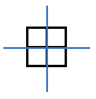
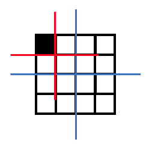
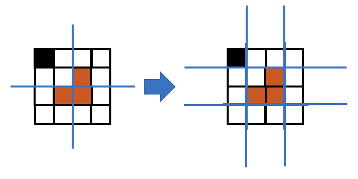
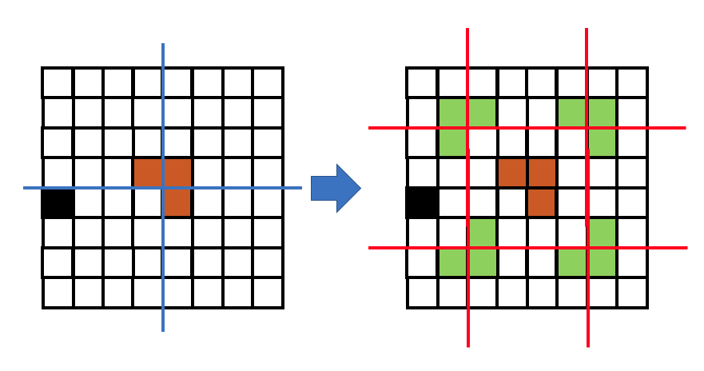

# L-트로미노(L-Tromino)

Divide and Conquer (분할 정복) 법을 이용한 대표 문제 중 트로미노 문제가 있다.

크기가 같은 정사각형 3개를 L 형태로 배치한 것을 L-트로미노라 한다.


2x2 칸에 L-트로미노를 배치한 예는 다음과 같이 4가지 방법이 있다.

L-트로미노는 가로 및 세로가 $2^N$ 칸인 경우에 내부의 1x1 한 칸을 제외하고 모두 채울 수 있다. (수학적 귀납법으로 증명해야 하나 증명은 생략한다.)

$2^N$ x $2^N$ 개의 빈 칸을 트로미노로 채우는 과정에 대해 귀납법 형태로 접근해보자.

먼저 n = 1 경우의 2x2 칸에 대해 생각해보자.



정사각형을 4개의 부위로 나눠 트로미노를 집어 넣는다 생각하면 당연하게 4칸 중 3칸만 넣을 수 있다.

다음 n=2 인 경우인 4x4에 대해 생각해보자. 임의로 한 칸을 빈칸으로 두자.



먼저 도형을 쪼개서 도형을 잘 보면 4x4의 중앙을 갈라서 2x2 부위 4개가 나온다. 잘 보면 십자선 기준 2사분면에 있는 도형은 2x2 도형과 닮아있으며 2사분면의 도형을 제외한 1, 3, 4분면을 합쳐 생각하면 큰 트로미노처럼 생겼음을 직관적으로 알 수 있다.

채우는 데 정해진 순서는 별도로 없겠지만 일반적으로 도형을 가르는 중앙의 4사분면의 만나는 점과 가까운 각 요소에 대해 먼저 채운다.

채우는 기준은 비어있지 않은 공간 (위에서 빈 공간으로 둘 공간이나 앞어 트로미노를 채운 공간) 의 분면을 제외하고 나머지 3개의 분면에 대해 채운다.



이후 위와 같이 나눠진 4개의 2x2 도형에 대해 2x2 도형을 채울때와 동일한 작업을 수행하여 채우면 된다.

N = 3인 경우에는 다음과 같다.



먼저 8x8 도형을 4x4 4개로 나눠 2x2 / 4x4 일때와 동일하게 접근하면 된다.

한 변의 길이가 $2^N$인 정사각형을 L-트로미노로 채우는 알고리즘을 일반화 하면 다음과 같다.

```
function tromino(매트릭스) {
    만약 매트릭스 크기가 2x2면
        2x2 매트릭스에서 채워지지 않은 부분만 채운다.
    2x2 매트릭스보다 크면
        매트릭스를 4등분 하여 빈 공간으로 둘 부분이나 채워지지 않은 칸을 찾는다.
        칸을 찾으면 그 칸이 존재하는 분면을 제외하고 나머지 3개 분면에 십자로 인접하는 부분만 채운다.
        이후 각 4개의 분면에 따라
            tromino(1사분면)
            tromino(2사분면)
            tromino(3사분면)
            tromino(4사분면)
        을 수행한다.
}
```

다음을 자바로 구현한 예제는 다음과 같다.

```java
public class LTromino {
    /*
    L-Tromino는 정사각형 3개를 L형태로 배치한 형태이다.
    L-Tromino는 가로-세로가 2^n 승의 길이를 가졌을 때 1x1 사각형을 제외하고 모든 공간을 채울 수 있다.
     */
    private int[] matrix[];
    private int xySize;

    // L-Tromino를 놓는 시퀀스
    int sequnce = 1;

    public LTromino(int size) {
        xySize = (int)Math.pow(2, size);
        matrix = new int[xySize][xySize];
    }

    public void fill(int posX, int posY) {
        if(posX < xySize && posY < xySize) {
            matrix[posX][posY] = -1; // 빈칸은 -1으로 세팅함.
        }
        fillRecursive(0, 0, xySize, xySize);
    }

    void fillRecursive(int startX, int startY, int endX, int endY) {
        // 주어진 공간을 쪼갠다.
        int sizeX = endX - startX;
        int sizeY = endY - startY;

        if(sizeX == 2 && sizeY == 2) { // square size가 2면 더 쪼개지 않는다.
            if(matrix[(startX)][(startY)] != 0) {
                fillTrominoSquare(startX, startY, 2, sequnce);
            } else if(matrix[(startX + 1)][(startY)] != 0) {
                fillTrominoSquare(startX, startY, 3, sequnce);
            } else if(matrix[(startX)][(startY + 1)] != 0) {
                fillTrominoSquare(startX, startY, 1, sequnce);
            } else if(matrix[(startX + 1)][(startY + 1)] != 0) {
                fillTrominoSquare(startX, startY, 4, sequnce);
            }
            sequnce++;
        } else {
            // 분할하기 전 비어있지 않거나 타일을 채우지 않을 공간을 찾는다.
            int posX = 0, posY = 0;
            int centerX = 0, centerY = 0;
            for (int i = startX; i < endX; i++) {
                for (int j = startY; j < endY; j++) {
                    if(matrix[i][j] != 0) {
                        posX = i;
                        posY = j;
                        // loop 종료
                        i = endX;
                        j = endY;
                    }
                }
            }

            int halfX = sizeX / 2;
            int halfY = sizeY / 2;
            // 주어진 공간을 1~4 사분면으로 나눈 후 위에서 찾아낸 특정 공간에 대해 각 4분면의 0점에 인접한 4칸에 트로미노를 채운다.
            centerX = startX + halfX - 1;
            centerY = startY + halfY - 1;
            if(centerX < posX) { // 특정 공간이 2, 3 사분면에 있음
                if(centerY < posY) { // 2사분면에 있으면
                    fillTrominoSquare(centerX, centerY, 4, sequnce); // 4사분면 형태로
                } else { // 3사분면
                    fillTrominoSquare(centerX, centerY, 3, sequnce);
                }
            } else { // 1, 4 사분면
                if(centerY < posY) { // 1사분면
                    fillTrominoSquare(centerX, centerY, 1, sequnce);
                } else { // 4사분면
                    fillTrominoSquare(centerX, centerY, 2, sequnce);
                }
            }
            sequnce++;

            // 4개로 쪼개서 재귀호출 시행
            fillRecursive(startX, startY, startX + halfX, startY + halfY); // 2사분면
            fillRecursive(startX + halfX, startY, endX, startY + halfY); // 1사분면
            fillRecursive(startX, startY + halfY, startX + halfX, endY); // 3사분면
            fillRecursive(startX + halfX, startY + halfY, endX, endY); // 4사분면
        }
    }

    void fillTrominoSquare(int startX, int startY, int status, int val) { // 시작점으로터 한칸씩만 비어있는 공간을 주어진 값으로 채운다.
        matrix[startX][startY] = (status != 2) ? val : matrix[startX][startY];
        matrix[startX + 1][startY] = (status != 3) ? val : matrix[startX + 1][startY];
        matrix[startX][startY + 1] = (status != 1) ? val : matrix[startX][startY + 1];
        matrix[startX + 1][startY + 1] = (status != 4) ? val : matrix[startX + 1][startY + 1];
    }

    public void printSquare() {
        for (int i = 0; i < xySize; i++) {
            for (int j = 0; j < xySize; j++) {
                System.out.print(matrix[i][j] + ((matrix[i][j] == -1 || matrix[i][j] > 9) ? " " : "  "));
            }
            System.out.println();
        }
        System.out.println();
    }
}
```

트로미노를 채우는 로직에 트로미노의 형태에 따라 혹은 채우는 순번에 따라 구분하는 로직에 의해 코드 로직이 다소 복잡하다.

fillTrominoSquare 메소드의 4번째 인수에 sequnce 혹은 트로미노 구분자를 넣음에 따라 출력이 달라진다.

다음은 각 트로미노가 집어넣는 순번에 따라 구분되는 출력 예제이다.

```
3  3  5  5  13 13 15 15 
3  2  2  5  13 12 12 15 
4  2  6  6  14 14 12 16 
4  4  6  1  1  14 16 16 
8  8  10 10 1  18 20 20 
8  -1 7  10 18 18 17 20 
9  7  7  11 19 17 17 21 
9  9  11 11 19 19 21 21 
```

각 트로미노가 순번에 따라 구분된 모습이다.

아래는 각 트로미노의 형태에 따라 별도 숫자로 구분한 예제이다.

```
4  4  3  3  4  4  3  3  
4  4  4  3  4  3  3  3  
1  4  4  4  3  3  3  2  
1  1  4  3  3  3  2  2  
4  4  3  3  3  2  3  3  
4  -1 2  3  2  2  2  3  
1  2  2  2  1  2  2  2  
1  1  2  2  1  1  2  2  
```

숫자의 의미는 1사분면이 빈 트로미노는 1, 2사분면이 빈 트로미노는 2라는 의미이다.