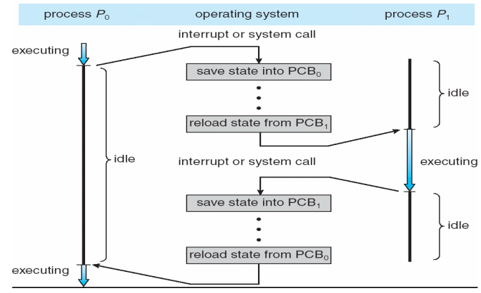
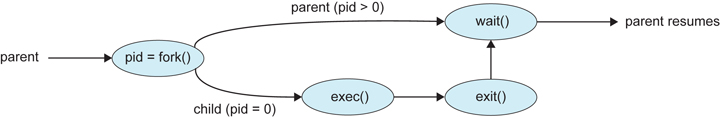

# 2. 프로세스

## 프로세스란?

프로세스는 운영체제에서 다루는 작업의 단위이자 프로그램이 메모리에 적재되어 실행되고 있는 상태를 의미한다.

쉽게 말하면 프로세스는 하드나 SSD에 있는 프로그램 (그러니까 바탕화면에 롤같은 프로그램이나 USB 안에 프로그램 등)이 메모리에 적재되 현재 실행 중인 프로그램을 의미한다.

### 태스크 (task)

프로세스와 태스크의 사전적 의미는 거의 유사하다. 프로그램이 메모리에 적재되어 있는 것을 의미한다.

### 프로그램

단순하게는 CPU에서 실행될 명령어들의 집합이라 할 수 있다. 하지만 우리가 실제로 실행하는 프로그램들은 단순히 명령어만 들어있는 것이 아니다. 우리가 실제로 사용하는 프로그램들의 확장자를 주목할 필요가 있다.

- 윈도우 : *.exe
- 리눅스/맥os : a.out 혹은 확장자 없어도 됨

이런 프로그램들을 "실행 파일" 이라고 한다. 그러면 실행 파일이 대체 뭐고 어떤 내용을 가지고 있는걸까?

### 실행 파일의 형식

윈도우/맥OS/리눅스 등 실행하는 CPU가 같은데도 운영체제에 따라서 같은 실행파일이 동작이 안된다. 윈도우나 맥북이나 같은 인텔 CPU를 사용하는데도 윈도우에서 돌리는 프로그램을 맥에서 돌릴 수 없는 이유에도 해당된다.

본질적인 문제는 운영체제가 사용하는 실행 파일 형식이 각자 다르기 때문이다.

- 윈도우 : PE 파일
- 리눅스 : ELF
- 맥OS : Mach-O
- 과거 유닉스 계통 : a.out
  - gcc로 파일명 안정하고 컴파일 하면 생성되는 그 a.out과 같은 의미이다. assembler output의 줄임말이다.

프로그램 컴파일을 하면 기계어가 생성되는데 기계어들을 OS에서 지원하는 형식에 맞게 잘 넣어둔 것이 실행 파일이다.

운영체제마다 실행파일이 어떻게 이루어졌는지 다 다르다. 또 실행파일을 바이너리 파일이라고 부르는 경우가 많은데 바이너리 파일의 의미는 이진 파일이란 의미다. 텍스트 파일, 그림 파일처럼 파일 내에 내용을 이진 데이터 그대로 읽는다는 의미로 이진 파일이라고 부른다.

## 프로세스의 특징

1. 프로그램(프로세스)이 메모리에 적재되어 있어야 한다.
2. 운영체제(커널)에 의해 스케줄링이 되어야 한다.

### 메모리에 적재된 프로세스의 구성

- 텍스트 섹션 : 실제 코드 명령어
- 데이터 섹션 : 전역 변수, static 변수
  - 데이터 섹션은 data와 bss로 세분화 시킬 수 있음.
  - Data 섹션 : 초기값이 존재하는 변수
  - BSS 섹션 : 초기화가 되지 않은 변수
- 힙 섹션 : 동적으로 할당되는 메모리 영역 (C에서는 malloc 등을 통해 할당하는 부분을 의미함.)
- 스택 섹션 : 함수 호출을 하면 함수 내 지역 변수, 함수 파라미터 등이 스택에 쌓임.
  - 그래서 재귀 함수를 잘못 사용하면 스택 오버플로우 발생함.

구조를 자세히 알고싶으면 [https://www.geeksforgeeks.org/memory-layout-of-c-program/](https://www.geeksforgeeks.org/memory-layout-of-c-program/) 참조

## 프로세스의 라이프 사이클

프로세스는 크게 5가지 상태를 가진다.

- new : 프로세스 생성 중
- ready : 프로세스 실행 기다림
- running : 프로세스 실행 중
- waiting : 프로세스가 신호 혹은 입출력 완료 이벤트를 기다림
- terminated : 프로세스 종료됨

위의 프로세스 사이클은 운영체제가 직접 관리한다.

### PCB (Process Control Block)

운영체제가 프로세스들을 관리하기 위한 정보들을 저장하기 위한 자료구조이다. PCB 내부에는

- 실행되는 프로세스의 상태
- CPU의 레지스터
- 점유하는 메모리 범위
- 기타 등등

의 정보를 가지고 있다.

###  Segmentation Fault

세그멘테이션 오류는 왜 발생하는 것일까? 멀티 프로그래밍을 하게 되면 프로그램마다 사용할 수 있는 메모리 영역이 정해진다. 이 영역은 PCB에도 기록된다. 만약에 코드가 프로세스에 허용되지 않은 메모리 주소에 접근하면 세그멘테이션 오류가 발생하며 이는 운영체제에서 프로세스가 다른 프로세스 메모리 영역에 접근하지 못하도록 방허하는 

## 프로세스 스케줄링

운영체제는 프로세스들을 동시에 실행되는 것처럼 관리해야 한다. 그러기 위해 프로세스들을 스케줄링을 해야 한다.

운영체제들은 보통 PCB들을 링크드 리스트 자료구조로 저장하는데 운영체제는 PCB들을 적절한 알고리즘으로 처리한다. (RR 스케줄링, 다단계 큐 스케줄링 등이 있다.)

### Context Switch

위에서 하나의 프로세서에서 여러 개의 프로세스들을 구동시킬 때 프로세스가 수행 중인 코드의 위치와 레지스터 값과 같은 정보들이 각각 프로세스에 독립적이어야 한다. 그런 정보들을 PCB에 저장하는 것이다.

운영체제는 적절한 알고리즘으로 프로세스들을 스케줄링 하는데 이 때 프로세스에서 다른 프로세스로 전환하는 것을 context switch라고 한다. (context를 번역하면 문맥인데 코드를 한줄한줄 실행하는 부분에 대해 context라고 하는 듯)

Context Switch가 너무 잦으면 오버헤드(오버헤드는 어떤 작업을 하는 데 간접적으로 소요되는 시간이나 자원을 말한다. 예를 들어 출퇴근을 할 때 길이 막히거나 엘리베이터가 고장나서 시간이 평소보다 3분 길어지면 오버헤드가 3분 길어진 것이다.)가 길어지기 때문에 운영체제가 적절하게 Context Switch를 해야 한다.

## 프로세스의 동작

### 부모-자식 프로세스

프로세스는 부모 프로세스와 자식 프로세스가 있다. 부모 프로세스와 자식 프로세스가 있기 때문에 다음과 같이 트리 형태로 표현될 수 있다.

위 그림은 리눅스에서 프로세스 간 관계를 트리 형태로 나타낸 것이다. 유닉스/리눅스(맥OS 제외)에서는 init이라는 최초의 프로세스가 가장 먼저 실행되어 하위로 리눅스를 구동하기 위한 여러 프로세스들을 실행한다. 사용자들이 실행할 수 있는 bash나 기타 프로그램들도 결국 뿌리를 찾아가다 보면 init 프로세스가 부모 프로세스가 된다.

그래서 새로운 프로세스를 생성하기 위해선 init과 같은 특수한 프로세스를 제외하면 모두 부모 프로세스에서 생성해야 한다.

### *nix 시스템에서 프로세스의 생성

init 프로세스를 제외하면 모든 프로세스는 부모 프로세스에서 다음과 같은 과정으로 생성된다.

리눅스/유닉스 운영체제 기준으로 프로세스를 다루는 시스템 콜은 크게 4가지가 있다.

- fork
- exec
- exit
- wait

#### fork

fork 시스템 콜을 실행하면 현재 프로세스를 그대로 복제하여 새로 만든다. pid 관련 값을 제외하고 완전히 동일하게 복제하는 것이기 때문에 새로 생성된 프로세스는 해당 시스템 콜에서 분기된다.

두 프로세스의 차이점은 부모 프로세스/자식 프로세스라는 것 외에는 없다.

fork 시스템 콜의 리턴값을 통해 현재 프로세스가 부모 프로세스인지 자식 프로세스인지 구분한다.

#### exec

exec 시스템 콜은 현재 실행중인 프로세스를 인수로 주어진 프로그램으로 바꾼다.

exec로 프로세스 내용이 변경되면 기존에 실행하고 있던 프로세스 내용이 새로운 프로그램으로 대체되는 것이다.

#### exit

해당 운영체제를 종료하기 위한 시스템 콜이다. 메인함수의 return 혹은 직접 exit 시스템 콜 혹은 종료 시그널 (ctrl + c 혹은 \\) 을 입력하면 정수 상태값 (exit 인수 혹은 메인 함수의 리턴값)을 남기고 메모리에서 헤제된다.

#### wait

wait 시스템 콜은 자식 프로세스가 종료될 때 까지 현재 프로세스를 블로킹 상태로 둔다. (아무런 동작도 하지 않게 잡아 둔다.)

#### Windows에서 프로세스 생성

윈도우에는 fork에 대응되는 시스템 콜이 없다. CreateProcess라는 시스템 콜을 사용해서 새 프로세스를 생성한다.

### 좀비 프로세스

자식 프로세스가 종료되면 부모 프로세스에서 자식 프로세스의 상태값을 받아야 한다. 운영체제는 부모 프로세스에서 자식 프로세스가 종료되면 wait같은 적절한 프로세스로 핸들링 하기 전까지 자식 프로세스의 상태값 등을 그대로 가지고 있다. 부모 프로세스에서 이를 처리하지 않을 경우 리소스가 낭비되므로 자식 프로세스를 적절히 관리하여야 한다.

### 고아 프로세스

부모 프로세스가 자식 프로세스보다 먼저 종료되면 자식 프로세스는 고아 프로세스가 된다. 이 때 고아 프로세스의 부모는 *nix 시스템 기준으로 pid = 1 이 된다.