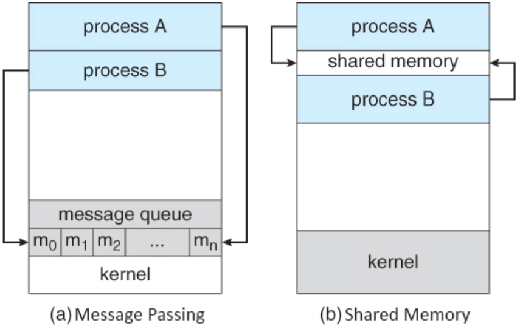

# 프로세스 간 통신 방법 (IPC)

IPC는 **프로세스 간 통신(Inter-Process Communication)**의 약자이다. 프로세스는 서로 간섭되어서도 안되고 독립적인 객체로 존재하므로 프로세스끼리 통신하려면 여러가지 방법을 사용해야 한다. 그런 방법들을 IPC라고 한다. 사실 거창하게 생각하지 않고 단순히 어느 프로세스에서 다른 프로세스의 상태나 동작들을 변경하는 것도 IPC에 속할 것이다.

## IPC가 작동되는 예

- 메모장이나 vi로 프로그램의 설정 파일을 변경하는 행위 (파일을 통한 IPC)
- php-fpm과 nginx를 연동하여 nginx 서버에서 php 스크립트가 동작되도록 함 (socket 혹은 unix domain socket을 이용한 IPC)
- 쉘에서 `ls | grep a` 와 같이 파이프 연산자 `|` 를 사용하는 것 (파이프를 통한 IPC)
- 기타 등등 독립적으로 실행되고 있는 프로세스끼리 통신하기 위해 다양하게 통신할 수 있다.

## IPC의 종류

여러가지 IPC가 있지만 아래 두 가지 방식을 기본적이고 핵심적인 IPC로 취급한다.

### 메모리 공유 (Shared Memory)

프로세스끼리 특정 메모리 영역을 공유하며 상호간 통신하는 방법이다.

- POSIX Shared Memory

### 메시지 전달 (Message Passing)

메시지 패싱은 커널이 제공하는 API를 이용해서 커널 공간을 통해 통신한다. 프로세스끼리 메시지를 전달할 때 메시지 큐에 넣어 두며 송신 프로세스는 큐에 enqueue, 수신 프로세스는 큐에 dequeue 하며 상호간 통신한다. 메시지 큐는 커널 단에서 관리한다.

- 파이프 (쉘에서 사용하는 그 파이프임)
- 소켓 (TCP/IP) - 로컬에서도 통신이 가능하며 원격에서도 통신이 가능하다. IP : 127.0.0.1일 경우 로컬에서 패킷을 통해 프로세스끼리 통신하기도 한다. (예 - nginx와 php-fpm)

### 그 외 방법 / 상세

- 파일을 통한 통신
- 신호 (Signal) - 거의 사용하지 않는다.
- 세마포어

## 생산자-소비자 문제 (Producer-Consumer Problem)

생산자 프로세스와 소비자 프로세스가 있고 데이터가 생산자 -> 소비자로 흐른다 생각해 보자. 소비자가 메시지 큐나 메모리 영역에 접근하여 데이터 (메시지)를 가져오고 생산자는 그 영역에 데이터를 집어 넣는다. 이런 경우 소비자가 가져올 데이터가 없거나 생산자가 데이터가 넣을 자리가 없을 수 있다. 이런 문제를 생산자-소비자 문제라고 한다.

생산자와 소비자를 적절한 규칙을 통해 동기화를 하여 원활하게 통신하도록 해결해야 한다. 예를 들면 소비자는 데이터 공간이 비어있지 않을 때 까지 접근하며 생산자는 남은 공간이 있을 때에만 접근한다.

이 문제는 주로 메모리를 공유하는 IPC에서 발생하는 문제이다.

## 많이 사용하는 IPC

### Message Passing

- 소켓 통신
- 파이프 통신

### Shared Memory

- Memory-Mapped File
- POSIX Shared Memory