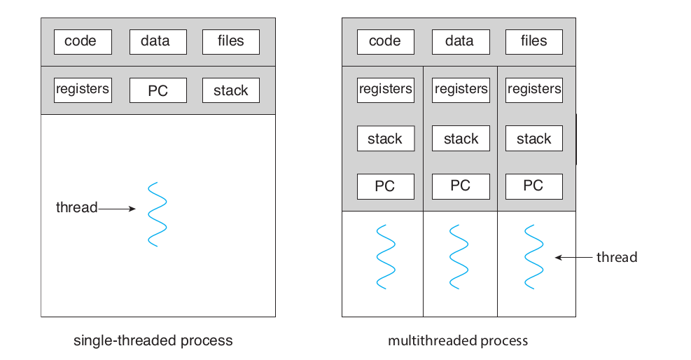

# 스레드

## Thread

- 스레드는 실제 CPU 코어 프로세서에서 동작되는 "단위"를 의미한다.
- 스레드를 직역하면 "실" 혹은 "이야기의 맥락" 을 의미한다. 아마 명령어의 흐름을 코어가 하나하나씩 실행하는 그것 자체를 이야기의 맥락이라고 보아 스레드라고 이름을 지은 듯 하다.
- 스레드는 경량화 된 프로세스가 될 수도 있으며 하나의 프로세스 내의 여러 개의 프로세스가 들어있을 수 있다.

### 싱글 스레드 프로세스 vs 멀티 스레드 프로세스

#### 싱글 스레드 프로세스

하나의 스레드만을 가지고 하나의 코드의 흐름만을 실행한다. 당연히 하나의 CPU 레지스터 저장공간 및 스택을 가진다.

스레드를 사용하지 않고 gcc 등을 이용해 컴파일한 결과물을 실행할 때 해당된다. 또 자바스크립트도 "원칙대로라면" 싱글 스레드로 동작된다. (자세한 내용은 다른 문서 참조)

#### 멀티 스레드 프로세스

하나의 프로세스 내에 여러 개의 스레드를 가질 수 있다. 스레드 개수 만큼의 CPU 레지스터 저장공간 및 스택을 가진다.

하나의 프로세스 내에서 여러개의 기능을 동일한 순간에 동작시키고 싶을 경우 멀티 스레드를 사용한다. 예를 들면 1:N으로 통신해야 하는 웹 서버같은 경우는 멀티 스레드로 동작되어야 한다.

### 왜 스레드를 사용하는가?

하나의 독립된 프로그램(프로세스)에서 단 하나의 기능만 수행하는 프로그램은 거의 없다. 쉘에서 계산을 하는 프로그램을 만드면 그것은 하나의 기능밖에 없으니 싱글 스레드로 충분하다. 하지만 우리가 실제로 사용하는 프로그램들을 보자.

게임도 게임을 실행하면 동시에 배경음, 화면 렌더링, 키 입력, 온라인 게임일 경우 네트워크 등 기능 단위를 코드로 쪼개보면 하나의 게임이지만 실제로 동시에 동작되어야 하는 기능들이 엄청 많다.

이런 기능 하나하나들을 하나의 메인 문 내에서 실행하는 것이 불가능할 것이다. 배경음 재생을 하면 다른 기능이 동작하지 않으며 화면 그리기만을 하고 있으면 화면을 그리는 동안 아무 배경음도 들리지 않을 것이다. 이런 기능 하나하나를 스레드로 나누어 하나의 프로세스 내에서 여러 개의 기능을 쪼개서 동시에 실행되는 것처럼 처리하는 것이다.

## 스레드의 특징

위 그림에서 표시되었다시피 멀티스레드 프로세스는 하나의 프로세스 자원 (코드, 전역변수, 파일 등)을 여러개의 스레드가 공유한다.

## 동시성과 병렬성

### 동시성

만약에 1 프로세서 1코어 CPU에서 멀티 스레드 프로그램을 실행한다 생각해보자. 혹은 1 프로세스 1코어 CPU에서 운영체제 + 여러가지 프로그램을 실행한다 생각해보자.

이런 상황에서 CPU의 작업 단위를 Task라고 하자. 전자에 경우에는 생선한 스레드만큼 태스크가 생성될 것이고 후자의 경우에는 OS 커널 등 여러가지 태스크가 하나의 CPU에서 동작될 것이다.

앞에 프로세스에서도 다룬 이야기랑 비슷하다. 이런 경우 보통 적절히 시분할을 하여 몇십 ms 단위로 각 태스크를 돌아가면서 실행한다. 이것이 동시성이다.

### 병렬성

하지만 최근의 컴퓨터는 1 프로세서 1 코어 CPU를 사용하지 않는다. 스마트폰도 4코어 8코어로 출시되는 시대이며 프로세서마저도 여러개 넣기도 한다. 이런 환경에선 진정한 의미로 동시에 여러 작업을 실행할 수 있다. 태스크 단위로 시분할을 하지 않고도 동시에 여러 작업을 실행할 수 있다.

위 그림과 같이 동시성과 병렬성을 적절히 응용해서 효과적으로 프로세스들이 실행되도록 OS가 적절히 관리한다. 사용자가 직접 관리하게 될 수도 있다. 이런 문제들은 병렬 컴퓨팅에 속하며 난해하고 어려운 문제들이다.

## 유저 스레드 & 커널 스레드

