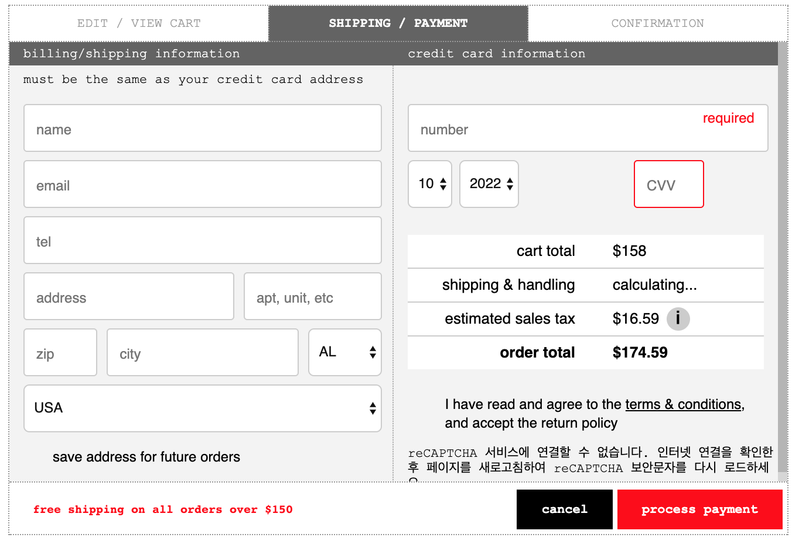
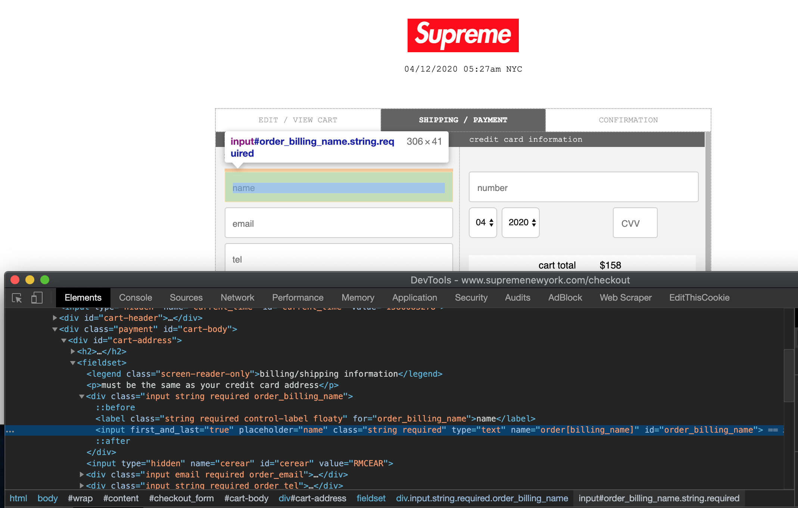
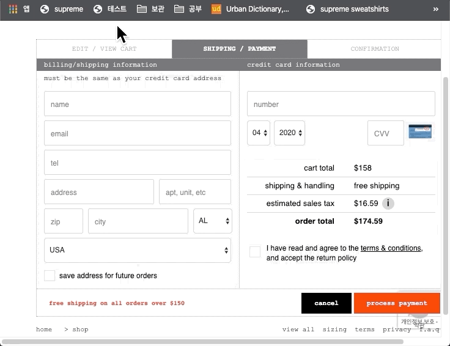

# 브라우저의 Bookmarklet을 이용하여 Supreme 구매정보 쉽게 입력하기 (오토필 대체)

## 1. Bookmarklet이란?

Bookmarklet은 브라우저 북마크에 자바스크립트로 작성된 코드를 삽입하여 새로운 동적 기능을 추가하는 것이다. Bookmarklet는 favelet 혹은 favlet이라는 이름으로 불리며 해당 페이지나 브라우저에 대해 작은 기능을 수행하는 것이 주 목적이다.

bookmarklet는 URL에 Javascript를 삽입하는 형태로 처음 고안되었으며 URL 주소에 http://가 아닌 javascript: 를 삽입함으로 해당 코드를 실행하게 된다. HTML 코드 상 링크에 javascript: 형태로 삽입되면 해당 주소로 이동하는 것이 아니라 자바스크립트 코드를 실행한다.

예를 들면 다음과 같다.

```html
<a href="javascript:alert('hello world!');">click</a>
```

해당 HTML 코드가 브라우저에서 구현되어 click 링크를 클릭할 때 javascript: 키워드 이후 자바스크립트 코드를 실행하여 hello world 팝업을 띄워 주는 식이다.

북마크에 저장된 내용도 단순 http 웹 링크를 포함하고 있으므로 북마크 URL에 javascript: 키워드를 삽입하여 해당 웹 페이지에서 본인이 원하는 기능을 javascript 기반으로 제작할 수 있다. (URI Schema에 http, ftp 등의 프로토콜을 의미하는 접두사 형식이 올 수 있다면 브라우저 한정으로 javascript 접두사를 추가하여 콜론 이후의 자바스크립트 코드를 구동하는 것이다.)

해당 스크립트는 현재 페이지에 대해 엑세스가 가능하며 브라우저의 내부 글꼴, 테마, 속성 등을 변경 가능하다.

## 2. 페이지 Form과 DOM이란?

HTML에서 사용자가 입력 가능한 입력 양식을 의미한다. HTML 기반의 웹 페이지는 내부 요소들이 구조화되어 있는데 우리가 사이트를 볼 때 모든 요소들이 있는 그대로 나열되어 있는 것이 아니라 특정 문법이나 규칙에 따라 구조화되어 있다는 의미이다.

DOM(Document Object Model)은 HTML 문서에 대한 프로그래밍 인터페이스를 의미하며 프로그래밍 언어 (주로 자바스크립트)가 HTML 요소에 접근을 할 수 있게 연결시켜주는 것을 의미한다.

예를 들면 다음과 같다.

```html
<!DOCTYPE html>
<html>
  <head>
    <script>
       function set() {
         var p_dom = document.getElementById("p_id"); // 현재 웹 페이지 객체의 getElementById 메서드를 이용하여 p_id 이름을 가진 DOM에 접근
         p_dom.innerHTML = "변경 후"; // 해당 요소의 innerHTML 프로퍼티를 변경하여 해당 엘리먼드의 내용을 변경
      }
    </script>
  </head>
  <body>
  <p id="p_id">변경 전</p>
  <a href="javascript:set();">DOM 접근 테스트</a>
  </body>
</html>
```

상기 코드를 브라우저 상에서 실행하여 링크를 클릭하면 p 태그 내의 내용이 변경 전 -> 변경 후로 변경됨을 확인할 수 있다.

## 3. 구매 정보 입력 form 접근

슈프림 shop 메뉴에서 원하는 물건을 장바구니에 담은 후 결제/배송 정보 입력 단계의 form 형태의 예는 2020년 4월 기준으로 다음과 같다.



이름, 이메일, 전화번호 등 배송 정보와 카드 정보를 입력하는 form이 존재한다. 구매 시 해당 정보를 기입하고 우측 하단의 빨간 버튼을 누르면 결제가 진행되는 식이다. (가끔 봇 방지용으로 reCAPTCHA가 뜨기도 한다.)

해당 Form의 입력 DOM에 접근하기 위해 ID를 파악하여 보자.



위에 결제자 이름을 입력하는 input 칸의 id는 order_billing_name에 대응된다. Input에 대한 고유 ID는 요소 검사를 통해 파악 가능하다.

현재 기준으로 각 Input 객체에 대한 ID를 작성하면 다음과 같다.

| Input 종류       | ID                    |
| ---------------- | --------------------- |
| Name             | order_billing_name    |
| Email            | order_email           |
| tel              | order_tel             |
| address          | bo                    |
| apt, unit, etc   | oba3                  |
| zip              | order_billing_zip     |
| city             | order_billing_city    |
| state            | order_billing_state   |
| country          | order_billing_country |
| card number      | rnsnckrn              |
| card vaild month | credit_card_month     |
| card vaild year  | credit_card_year      |
| card cvv         | orcer                 |

해당 Input 객체의 내용은 해당 DOM 객체의 value 프로퍼티를 변경하여 신규 값 삽입이 가능하다. 따라서 다음과 같은 형태로 DOM에 접근하여 값을 기록하면 된다.

```javascript
document.getElementById("input_id").value = "value";
```

해당 작업을 고려해야 할 점이 몇가지 있는데 슈프림은 부정 구매를 방지하기 위해 위 객체 ID를 종종 변경한다. 따라서 DOM 객체에 접근하지 못하는 예외 상황이 발생할 수 있으므로 예외 처리를 적절히 하여야 한다.

또 Bookmarklet를 이용하여 함수를 생성하여 실행할 때 보통은 즉시 실행 함수를 사용하여 기능을 생성한다. 즉시 실행 함수에 대한 내용은 추후에 포스팅 할 예정이다. 즉시 실행 함수의 예는 다음과 같다.

```javascript
(function (val) {
  console.log("즉시실행함수 예제.");
  console.log("매개 변수 전달 : " + val);
})('val');
```

위 두가지를 감안하여 슈프림 구매정보 입력 코드 함수를 작성하면 다음과 같다.

```javascript
( function ( data ) { // 익명 함수 선언
    for(var key in data) { // 전달받은 객체의 데이터가 들어있는 만큼 iteration. key는 전달받은 키-값 객체의 키
        try {
            document.getElementById(key).value = data[key]; // DOM 객체에 접근하여 값 할당
        } catch (e) { // 오류 핸들링
            console.log(data[key] + " 값 입력 실패"); // 오류시 콘솔 로그 기록 (선택사항)
        }
    }
} ) ( { // 데이터를 키-값 객체 형태로 전달 (키 : 객체 ID, 값 : 입력 값)
    order_billing_name : "PARK PROFQ", // 이름
    order_email : "daleaderprofq@gmail.com", // 이메일
    order_tel : "5031238600", // 전화번호
    bo : "999 Gates rd. suite B", // 주소
    oba3 : "2m00000", // 상세주소
    order_billing_zip : "07643", // zip 번호
    order_billing_city : "Little Ferry", // 도시
    order_billing_state : "NJ", // 주
    order_billing_country : "USA", // 국가 
    rnsnckrn : "4619 1234 1234 0000", // 카드번호
    credit_card_month : "10", // 월
    credit_card_year : "2022", // 년
    orcer : "000" // cvv 번호
} );
```

해당 코드를 즐겨찾기 주소에 기입하기엔 길이가 너무 길고 개행 문자도 포함되어 있으므로 크기를 줄인다. 이 과정을 보통 Packing이라고 한다. 온라인에서 구현된 임의의 javascript packer를 이용하여 해당 코드를 packing하면 다음과 같다.

```javascript
(function(a){for(var b in a){try{document.getElementById(b).value=a[b]}catch(e){console.log(a[b]+" 값 입력 실패")}}})({order_billing_name:"PARK PROFQ",order_email:"daleaderprofq@gmail.com",order_tel:"5031238600",bo:"999 Gates rd. suite B",oba3:"2m00000",order_billing_zip:"07643",order_billing_city:"Little Ferry",order_billing_state:"NJ",order_billing_country:"USA",rnsnckrn:"4619 1234 1234 0000",credit_card_month:"10",credit_card_year:"2022",orcer:"000"});
```

Bookmarklet 형태로 사용하기 위해 코드 앞단에 javascript 접두사를 붙인다.

```javascript
javascript:(function(a){for(var b in a){try{document.getElementById(b).value=a[b]}catch(e){console.log(a[b]+" 값 입력 실패")}}})({order_billing_name:"PARK PROFQ",order_email:"daleaderprofq@gmail.com",order_tel:"5031238600",bo:"999 Gates rd. suite B",oba3:"2m00000",order_billing_zip:"07643",order_billing_city:"Little Ferry",order_billing_state:"NJ",order_billing_country:"USA",rnsnckrn:"4619 1234 1234 0000",credit_card_month:"10",credit_card_year:"2022",orcer:"000"});
```

해당 코드를 크롬 혹은 사파리 즐겨찾기에 추가하여 url에 해당 코드를 기입하면 된다.

실행 결과는 다음과 같다.



정상적으로 정보가 삽입되는 것을 확인 가능하다. 이제 이 글을 읽는 독자가 슈프림을 구매하기 위해서 해킹 위험이 있는 Autofill 등을 이용할 필요가 없으며 해당 코드를 응용하여 슈프림을 보다 쉽게 구매할 수 있게 되길 희망한다.

## 4. 사용 요약

- 상기 코드의 기입된 정보를 본인의 구매 정보로 변경함
- 크롬, 사파리 환경에서 (IE에서 작동 되는지 확인하지 않음) 신규 즐겨찾기를 추가하여 해당 코드 복사하여 붙여넣어서 등록
- 결제 정보 입력 시 신규 즐겨찾기 클릭 시 위와 같이 정보가 기록됨

